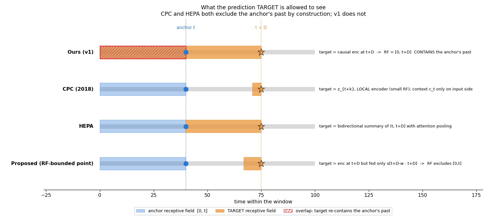
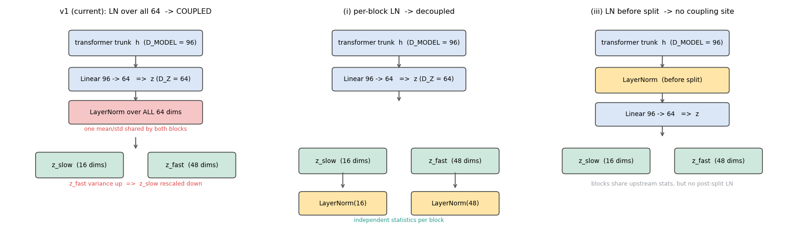

# HGLP v2 프로토콜 — 2차 질문과 답

이 문서는 `PROTOCOL_QA_ko.md`에 당신이 다시 달아준 `<>` 재질문 14개에 답한 것입니다. 이번 라운드는 이전과 성격이 다릅니다. 지난번 질문들이 "이게 무슨 뜻이냐"였다면, 이번 질문들 중 몇 개는 **우리 방법론의 근간이 맞느냐**를 되묻고 있고, 그중 둘은 제 이전 설명이 틀렸다는 것을 드러냈습니다. 그래서 답하기 전에 CPC와 HEPA 원문을 직접 확인했고, 그 결과를 근거로 씁니다.

## 이번 라운드에서 가장 중요한 세 가지

**첫째, 제가 틀렸습니다 — "윈도우 안에서 느린 상태가 일정해야 한다"는 요구는 잘못된 것입니다.** 그 요구를 받아들이면 우리는 static 요인만 분리하게 되고, 정작 더 중요한 "느린 상태를 추적하는 능력"을 스스로 없애버립니다. 당신이 Q6에서 던진 "sit → walk로 바뀌었으면 walk로 표현하는 게 우리가 지향하는 모델 아니야?"가 정확히 맞는 말이고, 제 A2 추천은 이 지적을 받아 뒤집혀야 합니다. (클러스터 1)

**둘째, 타깃 설계에 대한 당신의 의심도 맞았습니다.** CPC 원문과 HEPA 원문을 확인한 결과, **두 논문 모두 타깃의 수용장에서 앵커의 과거를 의도적으로 배제**합니다. 우리 v1만 그렇지 않습니다. 그리고 당신 표현대로 우리 타깃은 "point target"이라기보다 **"0부터 시작하는 누적 요약 target"**이 맞습니다. CLAUDE.md §5의 서술도 이 부분은 수정이 필요합니다. (클러스터 2)

**셋째, 당신이 맨 위에 적은 걱정이 타당합니다.** 질의응답이 새 질문을 낳아 정작 결정이 뒷전이 될 위험이 있습니다. 그래서 이 문서 마지막에 **결정 체크리스트**를 붙였습니다. 지금 시점에서 확정된 것이 12개, 남은 것이 6개이고, 그중 진짜로 다음 턴에 결정해야 하는 것은 **4개**입니다.

---

## 0. 질문 전체 목록과 상호 연관 지도

먼저 14개 질문을 빠짐없이 나열합니다. 번호는 원 문서의 Q번호를 따르되, 재질문이 여러 개면 a/b로 나눴습니다.

| # | 위치 | 질문 요약 | 소속 클러스터 |
|---|---|---|---|
| M | 문서 맨 위 | 질의응답이 새 질문을 낳아 결정이 뒷전이 될까 걱정. 결정/미결정 체크리스트가 필요 | → 6장 |
| 3a | Q3 | XJTU가 1분 간격으로 1.28초씩 찍힌 신호라는 건가? | 개별 (사실확인) |
| 3b | Q3 | 이런 세팅이면 static 분리가 가능한 것 아냐? PTB-XL과 유사한 상황 아님? | **클러스터 1** |
| 6b | Q6 | 활동 세그먼트보다 긴 윈도우 = 못 푸는 문제를 내는 것? 그럼 static만 배우는 것 아냐? sit→walk면 walk로 표현하는 게 맞지 않나? | **클러스터 1** |
| 8b | Q8 | 느린 성분을 배우는 것과 static 성분을 배우는 것의 차이가 어디서 발생하나? | **클러스터 1** |
| 10b | Q10 | 하나의 윈도우에 느린 상태가 하나뿐이니 학습 가능한 것 아냐? 진술이 자꾸 엇갈린다 | **클러스터 1** |
| 11a-b | Q11a | 우리는 3개 축을 다 보나, 1개만 골라 보나? | 개별 (사실확인) |
| 13b | Q13 | acc+gyro로 차원을 키우면 모델이 정확히 어떻게 학습하나? | 개별 |
| 15b | Q15 | HEPA는 RoPE를 쓰나? EMA+stop-grad 때문에 위치 임베딩이 굶는 것 아닌가? | **클러스터 3** |
| 18b | Q18 | 블록별 LN이 기본 트랜스포머와 뭐가 다른지 그림으로. 그리고 96인데 왜 임베딩은 64? 언제 정했나? | 개별 (+그림) |
| 19b | Q19 | 벡터→스칼라로 바뀌면 고려사항은? predictor가 스칼라를 수식에 어떻게 반영하나? | 개별 |
| 21b | Q21 | offset 개수를 늘릴 필요는 없나? 왜 로그 스케일인가? | **클러스터 3** |
| 22b | Q22 | 현재 타깃 X[0…t+Δ]에도 빠른 성분이 있잖아. 우리 타깃이 애초에 핵심 논리와 안 맞는 것 아닌가? point target이 아니라 누적 요약 target 아닌가? CPC부터 봐야겠다 | **클러스터 2** |
| 23b | Q23 | RoPE를 써도 앵커 범위가 한정되면 probe 위치 문제가 어떻게 해결되나? 앵커·호라이즌 샘플링 문제와 어떻게 연관되나? | **클러스터 3** |

### 연관 지도 — 14개가 사실은 4개의 뿌리에서 갈라집니다

```
뿌리 ①  "느린 것과 static한 것의 경계가 어디냐"
         └─ 3b, 6b, 8b, 10b  (+ A1 HAPT 역할, A2 라벨 정책, C2가 여기 종속)
              ↳ 결론: 제 이전 답이 틀렸음. A2 추천이 뒤집힘.

뿌리 ②  "타깃이 정말 우리 논증을 뒷받침하느냐"
         └─ 22b  (+ 15b의 EMA 부분이 여기로 연결)
              ↳ 결론: 당신 지적이 맞음. 선택지에 (iv)가 추가됨.

뿌리 ③  "위치·앵커·probe는 사실 하나의 결정 아니냐"
         └─ 15b, 21b, 23b  (+ B1, B4, C1이 전부 여기 묶임)
              ↳ 결론: 맞음. 세 항목을 하나로 묶어 결정해야 함.

뿌리 ④  "코드 사실 확인"
         └─ 3a, 11a-b, 13b, 18b, 19b
              ↳ 결론: 대부분 단순 확인. 단 11a-b에서 새 불일치 발견.
```

특히 **뿌리 ①과 ②는 서로 연결**되어 있습니다. 둘 다 "우리 방법이 실제로 무엇을 학습하도록 강제하는가"를 묻고 있고, ①은 데이터 쪽에서, ②는 손실 쪽에서 같은 지점을 찌릅니다. 그래서 두 클러스터를 순서대로 읽으시면 됩니다.

---

## 1. 클러스터 1 — "느린 성분 vs static 성분" (Q3b, Q6b, Q8b, Q10b)

### 먼저: 제가 틀렸습니다

제가 지난 문서 Q8에서 이렇게 썼습니다.

> "느린 성분을 배우려면, 그 느린 성분이 윈도우 내내 실제로 일정한 윈도우만 써야 한다"

**이 문장은 틀렸습니다.** 당신이 Q6b에서 지적한 대로, 이걸 받아들이면 우리는 static 요인을 분리하는 방법만 배우게 됩니다. 그리고 결정적으로, **우리 합성 데이터가 이 요구를 만족하지 않는데도 분리가 잘 됩니다.**

숫자로 확인해 보죠. 합성 데이터의 dwell은 3000 스텝이고 윈도우는 L×P = 256×8 = 2048 스텝입니다. 한 스텝당 전환 확률이 1/3000이니, 윈도우 하나에 들어가는 전환의 기댓값은 2048/3000 ≈ 0.68개입니다. 즉 **합성 윈도우의 약 절반이 regime 전환을 포함**합니다. 그런데도 v1에서 leak 0.79→0.19, regime 0.80 유지라는 분리가 나왔습니다.

그러니 "윈도우 안에서 느린 상태가 일정해야 한다"는 것은 **학습의 요구조건이 아닙니다.** 제가 라벨 위생(label hygiene)의 문제를 학습 요구조건으로 잘못 확대했습니다.

### 그럼 진짜 요구조건은 뭔가

세 가지입니다. 이게 CLAUDE.md §1의 "세 가지 적용 조건"을 실무 언어로 푼 것이기도 합니다.

**(1) 느린 성분은 Δ에 비해 지속적이어야 한다.** 즉 dwell ≫ Δ. 시각 t의 느린 상태를 알면 t+Δ의 느린 상태를 상당 부분 맞힐 수 있어야 합니다. 그래야 "느린 상태를 적어두는 것"이 예측에 이득이 됩니다. 윈도우 안에 전환이 있어도 됩니다 — 전환이 *예측 불가능*하다는 게 오히려 핵심입니다(CLAUDE.md §5: 예측기는 regime 전환을 미리 볼 수 없으므로 현재 상태를 인코딩하는 것 말고는 오차를 줄일 방법이 없다).

**(2) 빠른 성분은 Δ 안에 잊혀야 한다.** 즉 T_ac(fast) ≪ Δ. 이게 게이트를 닫아도 무해한 이유입니다.

**(3) 느린 성분이 학습 코퍼스 안에서 실제로 변해야 한다.** 전부 같은 값이면 배울 게 없습니다.

여기 어디에도 "윈도우 안에서 일정해야 한다"는 조건은 없습니다. 오히려 (1)의 "전환이 예측 불가능해야 한다"는 조건은 **전환이 존재해야** 의미가 있습니다.

### 그러면 느린 것과 static한 것의 차이는 어디서 나나 (Q8b)

**dwell의 길이**로 갈립니다. 그리고 그에 따라 **모델에게 요구되는 능력**이 달라집니다.

| | dwell | 모델이 해야 하는 일 | 예시 |
|---|---|---|---|
| **static 요인** | ∞ (기록 전체에서 불변) | 한 번 알아내고 그대로 유지. **추적 불필요** | PTB-XL 진단, 피험자 정체성 |
| **느린 요인** | 유한하지만 Δ보다 훨씬 김 | 상태를 **추적**하다가 바뀌면 갱신 | 합성 regime, HAPT 활동 |

static은 느린 요인의 **극한(dwell → ∞)**입니다. CLAUDE.md §5도 그렇게 적고 있습니다 — "Static factors are the infinite-persistence *constant* limit: they ride into z_slow by design (that is a feature)". 즉 static을 z_slow가 흡수하는 건 버그가 아니라 설계된 동작입니다.

**우리 방법은 둘 다 다룹니다.** 다만 보여줄 수 있는 것이 다릅니다. static 케이스에서는 "한 번 추론해서 z_slow에 넣는다"까지만 보여줄 수 있고, 느린 케이스에서만 **"상태가 바뀌면 z_slow가 따라 바뀐다"는 추적 능력**을 보여줄 수 있습니다. 후자가 훨씬 강한 주장입니다.

그래서 제가 제안했던 "윈도우를 세그먼트 안에 가둔다"는 제약은, **HAPT를 느린 케이스에서 static 케이스로 강등시키는** 나쁜 선택이었습니다. 당신 직관이 정확했습니다.

### Q6b의 마지막 질문에 직접 답하면

> "Input 윈도우 안에서 가장 최근 시점에 느린 상태가 sit → walk로 바뀌었으면 이건 walk의 표현으로 표현할 수 있는 게 우리가 지향하는 모델 아니야?"

**네, 정확히 그렇습니다.** causal 인코더의 위치 t 출력은 "시각 t 시점의 상태"를 담아야 하고, 방금 walk로 바뀌었다면 walk를 담아야 합니다. 이게 우리가 원하는 동작이고, 이걸 측정하는 것이 오히려 **가장 좋은 실험**입니다. 전환 직후 몇 패치 안에 z_slow가 새 활동으로 갱신되는지를 보면, "z_slow가 느린 상태를 추적한다"는 것을 직접 증명할 수 있습니다.

즉 지난번에 제가 "오염"이라고 부르며 배제하려 했던 57%가, 실은 **추적 능력을 측정할 수 있는 유일한 자료**입니다.

### 그럼 오염 문제는 완전히 없는 건가

아닙니다. 다만 훨씬 좁습니다. **위치별 라벨을 쓰면 오염 문제의 대부분이 자동으로 사라집니다.**

- **다른 활동이 섞인 경우(12%)**: 문제 없음. 각 위치를 그 위치의 라벨로 채점하면 됩니다.
- **전환 클래스 7–12가 섞인 경우(20%)**: 문제 없음. 라벨이 정의돼 있으니 그 위치는 전환 클래스로 채점하거나, 채점 대상에서만 빼면 됩니다.
- **VOID가 섞인 경우(25%)**: 여기만 실제 문제입니다. 라벨이 아예 없으니 **그 위치는 채점할 수 없습니다.** 하지만 그 위치의 *신호*는 입력으로 넣어도 전혀 문제없습니다 — 라벨이 없을 뿐 실제 신호니까요.

핵심 구분은 이겁니다. **입력 윈도우에서 배제하는 것과, 채점(probe) 대상 위치에서 배제하는 것은 다릅니다.** v1은 이 둘을 구분하지 않고 윈도우 통째로 버렸고, 저는 지난 문서에서 그 실수를 더 강화하는 방향으로 추천했습니다. 올바른 정책은 "윈도우는 무엇이든 담을 수 있다, 다만 라벨이 정의된 위치에서만 채점한다"입니다.

### XJTU는 왜 음성 사례인가 — 다시 (Q3b, Q10b)

당신이 "진술이 자꾸 엇갈린다"고 한 것도 맞습니다. 제가 XJTU를 "윈도우 안에 느린 상태가 없어서 안 된다"고 설명했는데, 그러면 PTB-XL도 똑같이 안 돼야 하죠. 정정합니다.

**구조적으로 XJTU와 PTB-XL은 같은 부류입니다.** 둘 다 라벨이 윈도우 안에서 상수이고 윈도우들 사이에서 변합니다. 즉 XJTU의 life도 static 요인처럼 학습 가능한 형태입니다. 당신 지적이 맞습니다.

XJTU가 음성인 **진짜** 이유는 다릅니다.

**시간척도 갭 자체가 없습니다.** EDA에서 확인했듯 XJTU는 캐리어도, 포락선도 1~2 패치 안에 탈상관합니다. 즉 윈도우 안에서 Δ가 2 패치만 넘어가면 **상수를 빼고는 아무것도 예측되지 않습니다.** 게이트는 "빠른 건 죽고 느린 건 살아남는" 대비를 이용하는 장치인데, 여기서는 대비가 없습니다. 전부 죽고 상수만 남으니 게이트가 할 일이 없습니다.

그리고 이게 실측으로도 확인됩니다. 기존 결과에서 life 예측 R²가 **z_slow 0.18, z_full 0.18**입니다. 즉 **게이트를 걸어서 얻은 이득이 0**입니다. 반면 PTB-XL은 게이트로 leak가 0.61→0.41로 떨어집니다.

그러니 XJTU에 대한 정확한 서술은 "느린 상태가 윈도우에 없다"가 아니라 **"윈도우 안에 빠른/느린 대비가 없어서 게이트가 기여하지 못한다(z_slow ≈ z_full)"**입니다. 이건 우리 스크린의 C1(시간척도 갭) 판정과 정확히 일치하고, "예측된 음성"의 근거로 오히려 더 깔끔합니다.

### 이 클러스터가 프로토콜에 미치는 영향

- **A2 라벨 정책**: 추천이 뒤집힙니다. "깨끗한 단일 세그먼트만" → **"윈도우는 전환·VOID를 담아도 되고, 라벨이 정의된 위치에서만 채점"**.
- **A1 HAPT 역할**: 오염을 근거로 한 격하 논거가 상당 부분 무너집니다. HAPT는 오히려 **추적 능력을 보여줄 수 있는 유일한 실데이터**일 수 있습니다. 남은 문제는 (i) auto-τ가 Δ_max 밖이라는 horizon 구성 문제와 (ii) 활동이 끝부분만 봐도 읽힌다는 문제, (iii) 윈도우 수가 적다는 문제입니다. 이 중 (i)은 고칠 수 있고, (ii)는 위치별 probe로 *측정*할 수 있습니다.
- **새 실험 제안**: 전환 직후 위치에서 z_slow가 얼마나 빨리 새 활동으로 갱신되는지 측정하는 **추적 지연(tracking latency) 실험**. 이건 지금 우리에게 없는 종류의 증거이고, static/slow 구분을 실증하는 그림이 됩니다.

---

## 2. 클러스터 2 — 타깃 정의 (Q22b)

### 당신 지적이 맞습니다. 그리고 원문이 그걸 증명합니다

당신이 이렇게 물었습니다.

> "현재의 타깃 X[0…t+Δ]에도 빠른 성분이 살아있잖아. '먼 horizon에서 z_fast가 무해하다'가 성립하려면 애초에 타깃이 X[t+Δ…] 이래야 하는 거 아니야? 애초에 point target이 아니라 '0부터 시작하는 구간 요약 target'이 맞는 말 같은데? CPC scratch부터 알아봐야겠는데?"

CPC와 HEPA 원문을 확인했고, **세 가지 모두 당신 말이 맞습니다.**



### CPC 원문 확인 결과

CPC(van den Oord 2018)의 구조는 두 부분입니다.

- **인코더 `g_enc`**: 입력을 **국소적으로** 인코딩합니다. 오디오에서는 stride [5,4,2,2,2]의 conv 5층으로 10ms당 벡터 하나. 즉 **수용장이 작습니다.**
- **자기회귀 모델 `g_ar`**: `c_t = g_ar(z_≤t)`, 과거를 **누적 요약**합니다.

그리고 결정적으로, InfoNCE의 밀도비는 이렇습니다.

```
f_k(x_{t+k}, c_t) = exp( z_{t+k}^T W_k c_t )
```

**타깃은 `z_{t+k}` — 국소 인코더의 출력이지, 누적 문맥 `c_{t+k}`가 아닙니다.** 누적 요약은 오직 **입력 쪽(앵커)에만** 있습니다. 즉 CPC는 타깃의 수용장에서 앵커의 과거를 구조적으로 배제합니다.

### HEPA 원문 확인 결과

HEPA도 같은 원칙을 다른 방식으로 지킵니다.

- **타깃**: "the same encoder f_θ applied **bidirectionally to x(t, t+Δt]** with attention pooling". 즉 타깃 인코더는 **미래 구간만** 봅니다. `x[0..t]`는 안 들어갑니다.
- **타깃 인코더**: weight-shared, 함께 학습(EMA 아님), **stop-grad 없음**.
- **위치 인코딩**: **sinusoidal absolute** — RoPE가 아닙니다. (Q15b의 답)
- **호라이즌 조건화**: predictor `g_φ(h_t, Δt)`에 **Δt를 스칼라로** 넣습니다. 임베딩 테이블이 아닙니다.
- **손실**: L1 + SIGReg(α=0.1). 인코더는 온라인 분기가 causal, 타깃 분기가 bidirectional.

### 그래서 우리 v1의 위치

| | 앵커 수용장 | 타깃 수용장 | 앵커 과거 포함? |
|---|---|---|---|
| **CPC** | [0, t] (누적) | t+k 부근 (국소) | **아니오** |
| **HEPA** | [0, t] (causal) | (t, t+Δ] (구간) | **아니오** |
| **우리 v1** | [0, t] (causal) | **[0, t+Δ]** (누적) | **예** ← 우리만 |

**우리만 타깃이 앵커의 과거를 다시 포함합니다.** 그리고 이건 우연이 아니라, CPC와 HEPA가 각자 다른 방식으로 **의도적으로 피한** 설계입니다.

### "point target"이라는 표현도 부정확합니다

당신 말대로입니다. 우리 타깃은 두 가지 의미가 섞여 있습니다.

- **평가 위치로 보면**: t+Δ 한 지점에서 뽑으니 "point"입니다.
- **내용으로 보면**: 그 지점의 causal 인코더 출력은 `x[0…t+Δ]` 전체의 요약이니, **"0부터 시작하는 누적 구간 요약"**입니다.

CLAUDE.md §5는 "ours = **point target at t+Δ** + EMA + L2"라고 적고 있는데, 이 표현은 두 번째 의미를 가립니다. HEPA와의 대비를 "점 대 구간"으로 서술하면 리뷰어가 "당신들 것도 구간 요약 아니냐, 다만 구간이 0부터 시작할 뿐"이라고 반박할 수 있습니다. **정확한 대비는 "구간의 시작점이 0이냐(우리) t냐(HEPA)"**입니다.

이건 CLAUDE.md의 잠긴 서술이라 제가 임의로 못 고칩니다. **수정 승인이 필요한 항목**으로 올립니다.

### 그럼 무해성 논증은 깨진 건가

**논증은 구멍이 있지만, 방법이 무너진 건 아닙니다.** 정직하게 나눠서 말하겠습니다.

논증의 구멍은 이렇습니다. 타깃이 `f(x[0…t+Δ])`이면, 그 안에 `x[0…t]`가 들어 있습니다. `z_fast(t)`는 t 근처의 빠른 정보를 담고 있으니, 원리적으로 타깃 예측에 도움이 될 수 있습니다. 그렇다면 "먼 Δ에서 z_fast를 잘라도 무해하다"가 자동으로 성립하지 않습니다.

하지만 실제로는 이렇게 될 가능성이 큽니다. 인코더는 각 위치에서 64차원 병목을 거치고, 그 표현은 "예측 가능하도록" 학습됩니다. 그래서 위치 t+Δ의 표현은 자연히 **t+Δ 시점의 상태**를 담는 쪽으로 수렴합니다. 실제로 v1에서 z_fast가 u를 R² 0.81로 담고 있다는 건, fast 블록이 *그 위치의* 빠른 상태를 담는다는 뜻입니다. 그렇다면 타깃의 fast 부분은 t+Δ에 관한 것이고, `z_fast(t)`로는 못 맞힙니다 — 무해성이 근사적으로 성립합니다.

문제는 **이게 보장이 아니라 경험적 관찰**이라는 점입니다. 아무것도 인코더가 t의 빠른 정보를 t+Δ 위치까지 밀반입하는 걸 막지 않습니다.

### 그래서 제안: 논증을 가정하지 말고 측정합시다

이건 이번 라운드에서 나온 가장 실용적인 결론입니다. **무해성은 직접 측정할 수 있는 양입니다.**

게이트 없이 학습한 모델에서, 각 Δ마다 "z_fast를 0으로 만들었을 때 예측 오차가 얼마나 늘어나는가"를 재면 됩니다. 무해성이 성립하면 이 증가분이 **Δ가 커질수록 0으로 수렴**해야 합니다. 그 곡선 하나가 우리 논증의 전제를 실증하는 그림이 되고, τ를 어디에 둬야 하는지도 데이터가 직접 말해줍니다(증가분이 사라지는 지점이 곧 τ입니다 — 이건 이미 백로그에 있는 "모델 기반 τ 추정"과 같은 아이디어입니다).

논증에 구멍이 있다는 지적에 대해, "논증을 더 정교하게 다듬겠다"보다 **"측정해서 보이겠다"**가 훨씬 강한 답입니다.

### B5 선택지가 하나 늘었습니다

기존 (i)(ii)(iii)에 더해, CPC 구조를 확인한 지금 네 번째 선택지가 생겼습니다.

**(iv) 수용장을 제한한 점 타깃.** 타깃을 여전히 t+Δ 한 지점에서 뽑되, 타깃 인코더에는 `x[t+Δ−w : t+Δ]`만 먹입니다. w를 t+Δ−w > t가 되게 잡으면 **타깃 수용장이 앵커의 과거와 완전히 분리**됩니다.

- CPC의 국소 타깃과 같은 정신이되, 별도 인코더를 만들 필요 없이 **같은 인코더에 짧은 입력을 주는** 것으로 구현됩니다.
- HEPA와도 다릅니다. HEPA는 구간 전체를 attention pooling으로 뭉개지만, 우리는 여전히 **한 지점**을 봅니다.
- 무해성 논증이 **구조적으로** 성립합니다. 타깃 수용장에 t 근방이 없으니 `z_fast(t)`가 타깃에 대해 가진 정보가 (느린 성분을 통하지 않고는) 없습니다.
- 비용: 타깃 인코더 forward가 한 번 더 필요하고(짧은 입력이라 저렴), w가 새 하이퍼파라미터로 생깁니다(스윕 대상).

제 의견을 보태면, **(iv)가 (i)의 구멍을 메우면서 (ii)의 대가는 치르지 않는** 선택입니다. 다만 이건 방법의 정체성을 건드리므로 여전히 당신 결정입니다. 다음 턴의 핵심 결정 4개 중 하나입니다.

---

## 3. 클러스터 3 — 위치 인코딩 · 앵커 샘플링 · probe 위치는 하나의 결정 (Q15b, Q21b, Q23b)

당신이 Q23b에서 "이 문제는 앵커와 호라이즌을 어떻게 샘플링할지 결정하는 문제와 연관 있는 것 같은데 어떻게 연관되지?"라고 물었습니다. **정확히 맞고, 사실 이 셋은 하나의 결정입니다.** 하나씩 풀어서 보이겠습니다.

### Q15b — HEPA는 RoPE를 쓰나? EMA가 문제인가?

**HEPA는 RoPE를 쓰지 않습니다. sinusoidal absolute positional encoding입니다.** (원문 §3.1 확인)

여기서 중요한 함의가 있습니다. sinusoidal은 **학습되는 파라미터가 아닙니다.** 고정된 삼각함수 값이죠. 그래서 HEPA에는 "위치 임베딩이 굶는다"는 문제가 **구조적으로 존재하지 않습니다.** 우리 v1이 학습형 절대 임베딩(`nn.Parameter`)을 쓰기 때문에 생긴 문제입니다.

그리고 "EMA가 문제인가"에 대한 답은 **"공범이지만 주범은 아니다"**입니다.

- EMA 타깃은 그래디언트를 전혀 받지 않습니다. 타깃 인코더의 위치 임베딩은 온라인 인코더의 EMA 복사본일 뿐입니다. 그러니 온라인 인코더에서 `pos[128:256]`이 안 배우면, EMA 복사본도 영원히 안 배웁니다. 이 점에서 EMA는 공범입니다.
- 만약 타깃 인코더가 그래디언트를 받으면(D2의 online 타깃 형태), 타깃 경로를 통해 `pos[128:256]`에도 신호가 갑니다. 당신 추론이 맞습니다.
- 하지만 **주범은 앵커 범위**입니다. 앵커가 `[64,128)`에만 있으니 그 위치들이 "예측의 출발점"으로 다뤄진 적이 없고, 이건 타깃에 그래디언트가 흐르든 말든 남습니다.

정리하면 세 가지 독립된 선택이 겹쳐서 생긴 문제입니다: **학습형 절대 임베딩** + **좁은 앵커 범위** + **EMA(그래디언트 차단)**. 셋 중 하나만 바꿔도 완화되고, HEPA는 첫 번째를, CPC는 구조 자체를 다르게 가져갑니다.

### Q23b — RoPE를 써도 앵커 범위가 좁으면 probe 위치가 왜 괜찮아지나

아주 좋은 반문이고, 제 지난 설명이 뭉뚱그렸습니다. 정확히 나누면 이렇습니다.

**RoPE가 해결하는 것**: 위치별로 학습되는 파라미터가 **아예 없어집니다.** RoPE에서 위치는 attention 안에서 상대 회전으로만 들어가고, "255번 위치 전용 벡터" 같은 게 존재하지 않습니다. 그러니 "255번 위치의 임베딩이 굶었다"는 문제는 정의상 사라집니다.

**RoPE가 해결하지 못하는 것**: 당신이 짚은 부분입니다. 앵커가 `[64,128)`에만 있으면, 모델이 학습 중에 경험한 **문맥 길이가 64~128**뿐입니다. 그런데 probe에서 위치 255를 읽으면 문맥 길이가 256입니다. 이건 **한 번도 학습되지 않은 문맥 길이 영역**이고, RoPE도 학습 범위를 넘는 길이에서는 성능이 떨어집니다(길이 외삽 문제).

**그래서 결론**: RoPE는 "위치 파라미터가 굶는 문제"만 없애고, "문맥 길이 불일치"는 그대로 남습니다. 그리고 **문맥 길이 불일치를 없앨 수 있는 건 앵커 샘플링 범위뿐입니다.**

### 세 항목이 하나인 이유

이렇게 연결됩니다.

```
앵커를 어느 범위에서 뽑느냐 (B4)
   → 어떤 문맥 길이가 학습되느냐를 결정
      → 어떤 위치를 probe해도 되는지를 결정 (C1)
         → 위치 인코딩 선택 (B1)은 "위치 파라미터가 굶느냐"만 추가로 좌우
```

즉 **B4(앵커 샘플링)가 상위 결정이고, C1(probe 위치)은 그 결과이며, B1(위치 인코딩)은 직교하는 보조 선택**입니다. 지난 프로토콜에서 이 셋을 따로 적어놔서 혼란스러웠습니다.

가장 단순한 해법은 이겁니다. **앵커를 유효한 전 범위에서 뽑으면**(즉 문맥 최소 길이부터 `L − Δ_max`까지) 모든 문맥 길이가 학습되고, 그러면 probe를 어디서 읽든 학습 분포 안입니다. 그러면 위치 인코딩은 학습형 절대든 sinusoidal이든 RoPE든 **부차적인 선택**이 됩니다. 지난 문서에서 제가 "(b) 앵커 범위 확대가 더 보수적"이라고 톤을 바꾼 것도 같은 이유였고, 이번 분석은 그걸 더 강하게 뒷받침합니다.

### Q21b — offset 개수를 늘릴 필요는? 왜 로그 스케일?

**왜 로그 스케일인가.** 우리가 다루는 현상이 곱셈적이기 때문입니다. 중요한 건 Δ의 절대값이 아니라 **Δ / T_ac 비율**입니다. "빠른 성분 수명의 2배냐 20배냐"가 게이트의 동작을 결정하죠. 그리고 우리가 훑어야 하는 범위가 T_ac(min) ≈ 5 패치부터 T_ac(max) ≈ 82 패치까지, 즉 **한 자릿수 이상 차이**납니다. 선형 간격(예: 1,2,3,…,128)으로 뽑으면 점의 대부분이 작은 Δ에 몰려서 먼 horizon 쪽이 비어버립니다. 로그 간격이라야 양쪽을 고르게 덮습니다. 실제로 v1의 `[1, 4, 16, 64, 128]`은 대체로 4배씩 늘어나는 구조입니다(마지막만 윈도우 길이에 막혀 2배).

다만 이것도 근거가 기록된 적은 없습니다 — 초기 커밋에서 그냥 정해졌습니다. 그래서 "로그가 맞다"는 위 논리는 **사후 정당화**이고, 정직하게 그렇게 적어야 합니다.

**개수를 늘릴 필요가 있나.** 있습니다. 그리고 **B3(연속 조건화)를 채택하면 "개수"라는 개념 자체가 바뀝니다.**

- 지금은 Δ를 5개 고정값에서만 뽑을 수 있습니다. 임베딩 테이블이 5칸뿐이니까요.
- 연속 조건화로 바꾸면 **Δ를 매 스텝 연속 구간에서 랜덤하게 샘플링**할 수 있습니다. 예를 들어 `log Δ ~ Uniform(log 1, log Δ_max)`로 뽑는 거죠. 그러면 격자가 아예 없어지고, τ 근처가 조밀하게 덮이며, "본 적 없는 Δ" 문제도 사라집니다.
- 이게 B3와 B4를 자연스럽게 잇는 지점입니다. 연속 조건화는 단지 predictor의 입력 형식 변경이 아니라, **샘플링 전략을 바꿀 자유를 줍니다.**

그리고 확인된 사실 하나 — **HEPA도 Δt를 스칼라로 predictor에 넣습니다.** 즉 연속 조건화는 우리만의 새로운 아이디어가 아닙니다. B3를 "우리 기여"로 주장하면 안 되고, "표준적인 선택을 따랐다"고 적는 게 맞습니다. 지난 문서에서 제가 이 부분을 마치 우리 발명처럼 서술했는데, 정정합니다.

---

## 4. 개별 질문들

### Q3a — XJTU가 1분 간격으로 1.28초씩 찍힌 신호라는 건가?

**네, 정확합니다.** 각 스냅샷이 32,768 샘플 @ 25.6 kHz = 1.28초이고, 스냅샷은 **1분에 하나씩** 기록됩니다. 그래서 Bearing1_1의 스냅샷 123개는 곧 **수명 123분**을 뜻합니다.

바꿔 말하면 1분 중 1.28초만 녹음되고 **나머지 58.7초는 기록이 없습니다.** 이것이 "느린 축을 이어서 볼 방법이 없다"는 말의 실체입니다. 열화는 분 단위로 진행되는데, 우리가 가진 건 그 사이사이의 1.28초 조각들뿐이라 연속적인 궤적으로 볼 수가 없습니다.

### Q11a-b — 우리는 3개 축을 다 보나, 1개만 보나?

**모델은 3축을 다 봅니다.** `hapt_prep.py`가 `w.reshape(L, PATCH * 3)`으로 저장하고, `hapt_train.py`의 `PATCH, L = 12, 128` 주석이 "12 = 4 samples × 3 axes"라고 명시합니다. 즉 패치 하나가 4샘플 × 3축 = 12차원이고, 인코더 첫 Linear가 12 → 96입니다.

**그런데 여기서 새로운 불일치를 하나 발견했습니다.** T_ac를 측정한 `tac_real.py`는 이렇게 합니다.

```python
sig = np.linalg.norm(W, axis=-1).reshape(len(W), -1)  # accel magnitude
```

즉 **3축을 크기(magnitude) 하나로 뭉개서** T_ac를 쟀습니다. 그러니 우리가 τ를 정하는 데 쓴 신호와 모델이 실제로 보는 신호가 **다릅니다.** 크기는 회전 불변이라 자세(중력 방향) 정보가 이미 빠져 있고, 그래서 측정된 T_ac가 모델 입력의 시간 구조를 대표하지 못할 수 있습니다.

이건 프로토콜에 없던 항목이라 **새 미결정 사항으로 추가**합니다: τ 추정을 (a) magnitude로 할지, (b) 축별로 재서 결합할지(예: 축별 T_ac의 최솟값), (c) 다변량 ACF로 할지. 당신 질문이 아니었으면 못 찾았을 불일치입니다.

### Q13b — acc+gyro로 차원을 키우면 모델이 정확히 어떻게 학습하나?

지난 답이 너무 짧았습니다. 제대로 풀겠습니다.

**무엇이 바뀌나.** 인코더의 첫 레이어는 `nn.Linear(PATCH, D_MODEL)`, 즉 `Linear(12, 96)`입니다. 이건 패치 하나(4샘플 × 3축 = 12개 숫자)를 96차원으로 올리는 선형 사상입니다. 자이로를 붙이면 패치가 4샘플 × 6채널 = 24차원이 되고, 레이어는 `Linear(24, 96)`이 됩니다. **바뀌는 건 이 레이어 하나뿐**이고, 파라미터는 12×96=1,152개에서 24×96=2,304개로 늘어납니다. 전체 0.5M 중 1,000개 남짓이니 모델 용량 측면에서는 사실상 변화가 없습니다.

**모델이 학습하는 방식은 어떻게 달라지나.** 이 첫 레이어는 "패치 안의 모든 샘플과 모든 채널을 섞어 96차원 특징을 만드는" 역할입니다. 자이로가 들어오면 이 레이어가 **가속도와 각속도를 결합한 특징**을 만들 수 있게 됩니다. 예를 들어 "수직 가속 진동 + 요(yaw) 회전"이 동시에 큰 패턴은 계단 오르기에 특징적이지만 평지 걷기에는 없습니다. 지금은 가속도만으로 그런 결합 특징을 만들 수 없습니다.

**그런데 주의할 점이 셋 있습니다.**

첫째, **스케일 불일치**입니다. 가속도는 g 단위로 대략 ±2 범위이고, 자이로는 rad/s 단위로 범위가 완전히 다릅니다. 정규화 없이 그냥 붙이면 큰 쪽 채널이 그래디언트를 지배합니다. 그래서 **A4(채널)는 A3(정규화)와 묶여 있습니다** — 채널당 전역 표준화를 먼저 정해야 자이로 추가가 의미를 갖습니다.

둘째, **"빠른 성분"의 정의가 바뀝니다.** 지금 HAPT의 fast 프록시는 `accmag`(가속도 크기)입니다. 자이로를 입력에 넣으면 모델의 z_fast는 회전 관련 빠른 성분도 담게 되는데, 우리 leak 지표는 여전히 accmag만 봅니다. 그러면 **leak를 과소평가**하게 됩니다. 자이로를 쓰려면 fast 프록시도 같이 확장해야 합니다(예: 각속도 크기도 함께 측정).

셋째, 위 두 가지 때문에 **자이로 추가는 단순 ablation이 아니라 지표 정의 변경을 동반**합니다. 그래서 저는 이걸 스프린트 항목이 아니라 후순위로 두기를 권합니다.

### Q18b — 블록별 LN이 기본 트랜스포머와 뭐가 다른가 (그림), 그리고 96 vs 64는 언제 정했나



**그림 설명.** 세 경우 모두 트랜스포머 트렁크(96차원)까지는 동일합니다. 차이는 그 뒤입니다.

- **왼쪽 (v1 현재)**: `Linear(96→64)`로 z를 만든 뒤, **64차원 전체에 LayerNorm 하나**를 겁니다. LayerNorm은 "64개 값의 평균과 표준편차로 정규화"하는 연산이라, z_fast 48개의 분산이 커지면 공통 표준편차가 커지고 그 결과 **z_slow 16개도 함께 축소**됩니다. 이게 결합입니다.
- **가운데 (i) 블록별**: z를 16 + 48로 나눈 **뒤에** 각각 따로 LayerNorm을 겁니다. LayerNorm(16)은 z_slow 16개만의 통계를 쓰고, LayerNorm(48)은 z_fast 48개만의 통계를 씁니다. **두 통계가 독립**이라 한쪽 분산이 다른 쪽 스케일에 영향을 주지 않습니다.
- **오른쪽 (iii) 분할 전**: 블록 의미가 생기기 전에 정규화하고, 최종 출력에는 LN을 안 겁니다. 결합이 생길 자리 자체를 없앱니다.

**기본 트랜스포머와의 차이.** 표준 트랜스포머(특히 `norm_first=True`인 pre-LN)는 각 블록 입구에서 **모델 차원(96) 전체**에 LayerNorm을 겁니다. 우리가 논의하는 건 그게 아니라 **트랜스포머를 다 통과한 뒤 출력 투영에 붙인 추가 LayerNorm**입니다. 즉 (i)로 바꿔도 트랜스포머 내부는 전혀 건드리지 않습니다 — 표준 구조 그대로이고, 마지막 한 줄만 바뀝니다. 그래서 "찜찜하다"고 하신 부분은 안심하셔도 됩니다. 비표준적인 아키텍처 개조가 아니라, **출력단 정규화를 블록 구조에 맞춰 정렬**하는 것뿐입니다.

**96인데 왜 임베딩은 64인가, 언제 정했나.** git으로 확인했습니다.

```
d741957  Horizon-Gated JEPA: label-free slow/fast factor separation  (최초 커밋)
  D_MODEL, D_Z = 96, 64
```

**최초 커밋에서 그냥 정해졌고, 근거는 기록에 없습니다.** vfloor 항과 똑같은 부류입니다.

두 숫자의 역할은 다릅니다. `D_MODEL=96`은 **트랜스포머 내부의 작업 공간 너비**이고, `D_Z=64`는 **밖으로 내보내는 표현의 크기**입니다. 둘을 다르게 두는 것 자체는 흔한 설계입니다(내부는 넓게 두고 출력은 좁혀 병목을 만듦). 그리고 우리에게는 **출력을 좁히는 것이 메커니즘의 일부**입니다 — v1의 폭 스윕 결과가 "분리는 slow 블록의 절대 크기를 따라간다"였으니, D_Z와 d_slow는 의미 있는 하이퍼파라미터입니다.

다만 **96과 64라는 구체적 값에는 근거가 없으므로 스윕 대상**입니다. 특히 `D_MODEL < D_Z × 2`라는 지금 비율(96 vs 128)은 통상적이지 않습니다. 보통은 내부가 출력보다 훨씬 넓습니다. 이것도 스윕에 넣겠습니다.

### Q19b — 벡터에서 스칼라로 바뀌면 고려사항은? predictor가 스칼라를 수식에 어떻게 반영하나?

**핵심부터**: 스칼라를 그대로 넣으면 안 됩니다. 반드시 **벡터로 다시 펼쳐서** 넣어야 합니다. 이유를 수식으로 보이겠습니다.

**v1(벡터 조회)의 수식.** predictor의 첫 레이어는 이렇습니다.

```
입력 = concat( z_a , e_d )          e_d = Embedding[d]  ∈ R^16
h    = W · 입력 + b
     = W_z · z_a  +  W_e · e_d  +  b
```

여기서 `W_e · e_d`는 Δ에 따라 달라지는 **편향 벡터**입니다. Δ가 5종이니 이 편향도 5종이고, 서로 아무 관계가 없습니다.

**스칼라를 그냥 넣으면 생기는 문제.** `e_d` 자리에 `logΔ`(숫자 하나)를 넣으면:

```
h = W_z · z_a  +  w · logΔ  +  b        w ∈ R^256 (벡터 하나)
```

Δ의 효과가 **`w` 방향으로의 직선 이동 하나**로 제한됩니다. 즉 모든 Δ에 대한 조건화가 1차원 직선 위에만 존재합니다(rank-1 제약). Δ=1일 때와 Δ=128일 때 predictor가 해야 할 일은 질적으로 다른데, 직선 이동만으로는 그 차이를 표현하기 어렵습니다. **이게 "스칼라로 바꿀 때 고려해야 할 사항"의 핵심입니다.**

**그래서 스칼라를 벡터로 펼칩니다.** 두 가지 표준 방식이 있습니다.

*방법 A — 작은 MLP:*
```
e_d = MLP(logΔ) ,  MLP: R → R^32 → R^16
```
`logΔ` 하나를 받아 16차원 벡터를 만듭니다. v1과 형태가 같아지되(16차원 벡터), **테이블 조회가 아니라 연속 함수**라서 Δ=30 같은 값도 자연스럽게 대응됩니다.

*방법 B — 푸리에 특징(사인 임베딩):*
```
e_d = [ sin(ω_1 logΔ), cos(ω_1 logΔ), … , sin(ω_8 logΔ), cos(ω_8 logΔ) ]  ∈ R^16
```
여러 주파수로 펼칩니다. MLP보다 학습 파라미터가 없고, 서로 다른 Δ가 잘 구분되면서도 가까운 Δ끼리는 비슷한 벡터가 됩니다.

**벡터일 때와 무엇이 다른가.** 표를 만들면 이렇습니다.

| | v1 (Embedding 조회) | 연속 조건화 |
|---|---|---|
| Δ=16이 4와 64 사이임을 아는가 | 모름 | **암 (숫자가 그렇게 생김)** |
| 학습에 없던 Δ=30 | 불가능 | **가능** |
| 파라미터 | 5 × 16 = 80개 (Δ마다 독립) | MLP 방식 ~600개, 푸리에 방식 0개 |
| Δ 샘플링 | 5개 격자에 고정 | **연속 구간에서 자유롭게** (Q21b와 연결) |

**참고로 HEPA는 방법과 비슷하게 Δt를 스칼라로 predictor에 넣습니다.** 앞서 말했듯 이건 우리 발명이 아니라 표준적 선택이고, 그렇게 서술해야 합니다.

어느 쪽(MLP vs 푸리에)을 쓸지는 여전히 임의값이라 스윕 대상입니다. 다만 **"스칼라를 벡터로 펼쳐야 한다"는 것 자체는 결정 사항**이고, 이건 근거가 명확하니 확정하겠습니다.

---

## 5. 이 라운드가 프로토콜에 남긴 수정거리

지난 라운드 것에 이번 것을 더해 정리합니다.

**지난 라운드에서 이미 확정된 수정 (아직 본문 미반영)**
1. B1 정정 — `pos[0:64]`는 학습됨, 미학습은 `pos[128:256]`뿐. 심각도 톤 하향.
2. B5 근거 교정 — (ii) 반대 이유를 "HEPA가 된다" → "무해성 논증의 전제가 깨진다".
3. A1(b) 명확화 — probe에 쓰는 인코더를 무엇으로 학습하는지 명시.
4. 그림 2장 인라인.

**이번 라운드에서 새로 생긴 수정**
5. **A2 추천 뒤집기** — "깨끗한 단일 세그먼트만" → "윈도우는 전환·VOID를 담아도 되고, 라벨이 정의된 위치에서만 채점". (클러스터 1)
6. **A1 HAPT 재평가** — 오염 논거가 약해졌으므로 격하 추천을 재검토. HAPT는 추적 능력을 보여줄 유일한 실데이터일 수 있음.
7. **CLAUDE.md §5 서술 수정 요청** — "point target at t+Δ"는 부정확. "0에서 시작하는 causal 누적 요약을 t+Δ에서 읽음"이 정확. **잠긴 서술이라 당신 승인 필요.**
8. **B3 신규성 조정** — 연속 Δ 조건화는 HEPA도 하는 표준 선택. 우리 기여로 주장하지 않기.
9. **B5에 선택지 (iv) 추가** — 수용장을 제한한 점 타깃.
10. **새 실험 제안** — 무해성 직접 측정(Δ별 z_fast 제거 시 오차 증가 곡선). τ 추정의 모델 기반 대안과 같은 실험으로 묶임.
11. **새 미결정 사항** — τ 추정 채널 불일치(모델은 3축, T_ac는 magnitude).
12. **B1/B4/C1 통합** — 세 항목을 "앵커 샘플링이 상위 결정"으로 묶어 재서술.
13. **D_MODEL/D_Z 스윕 추가** — 96/64는 최초 커밋의 근거 없는 값.
14. **Δ 로그 간격 근거 기록** — 사후 정당화임을 명시.

---

## 6. 결정 체크리스트 (당신의 맨 위 질문에 대한 답)

당신 걱정이 맞아서, 지금 상태를 한 판에 정리합니다. **결정된 것 12개, 남은 것 6개, 그중 다음 턴에 꼭 정해야 할 것 4개**입니다.

### ✅ 확정 (근거 있음, 재론 불필요)

| # | 항목 | 결정 내용 |
|---|---|---|
| 1 | B6 손실 | L2 + λ·xcov, variance floor 없음 (D7로 확정) |
| 2 | A5 재현성 | 합성 데이터 콘텐츠 해시 저장, 시드 결정론 확인됨 |
| 3 | C3 누수 방지 | 그룹 분할 + 비겹침 평가 윈도우 + assert |
| 4 | C4 지표 | 절대 점수, chance 명시, 선형+MLP+MINE, RankMe 붕괴 감시 |
| 5 | A1 합성 윈도우 | L=256, Δ_max=128 (걸침 규칙 만족) |
| 6 | A2 PTB-XL/XJTU 라벨 | 기록·스냅샷 단위 라벨 유지, life는 RUL 아님을 명시 |
| 7 | A4 XJTU/PTB-XL 채널 | 수평 1채널 / 리드 II — 근거 문서화 완료 |
| 8 | A5 합성 정규화 | raw 유지 (고정 스케일, 설계된 SNR) |
| 9 | B3 Δ 조건화 | 연속 조건화 채택. **단 스칼라를 벡터로 펼쳐서** 넣을 것 (Q19b) |
| 10 | **A2 라벨 위치** | **위치별 라벨. 윈도우는 전환·VOID 허용, 라벨 있는 위치만 채점** ← 이번 라운드 확정 |
| 11 | **C2 probe 라벨** | 위 10에 종속 → 자동 결정 (probe 위치의 라벨 사용) |
| 12 | D 스윕 틀 | 시드 3개, run JSON에 config+해시+버전 기록 |

### ⛔ 다음 턴에 결정해야 할 것 (4개 — 여기에 집중)

| # | 항목 | 선택지 | 제 추천 | 왜 지금 정해야 하나 |
|---|---|---|---|---|
| **D1** | **B5 타깃 정의** | (i) causal 누적 유지 / (ii) HEPA식 구간 / (iii) 잔차 / **(iv) 수용장 제한 점 타깃** | **(iv)** | 방법의 정체성. 코드 구조가 여기서 갈림 |
| **D2** | **B4 앵커 샘플링 범위** | 전 범위 / 좁은 범위 유지 | **전 범위** | B1·C1이 여기 종속. 상위 결정 |
| **D3** | **A3 정규화 범위** | 데이터셋 전역 / 기록별 / 윈도우별 | **전역** | 실데이터 전처리가 여기서 갈림 |
| **D4** | **A1 HAPT 역할** | 정식 테스트베드 / probe 전용 / 정적 부분집합 | **재검토 필요** (이번 라운드로 논거 변경) | 실험 계획 전체가 여기 종속 |

### 🔁 결정은 됐고 값만 스윕할 것 (지금 정할 필요 없음)

λ(xcov), EMA rate, LR, steps, 게이트 W, d_slow, Δ 인코딩 형태(MLP vs 푸리에), 학습 윈도우 겹침, 앵커·Δ 밀도, D_MODEL/D_Z, 타깃 수용장 폭 w(D1에서 (iv) 선택 시).

### 📌 결정과 별개로 처리할 것

| 항목 | 성격 |
|---|---|
| B1 위치 인코딩 | D2가 정해지면 부차적 선택이 됨 (학습형/sinusoidal/RoPE 아무거나) |
| B2 출력 정규화 | (i) 블록별로 사실상 결론. 표준 구조를 안 건드림이 확인됨 (Q18b) |
| C1 probe 위치 | D2에 종속 → 자동 결정 |
| τ 추정 채널 불일치 | 신규 발견. D3(정규화)와 함께 처리 |
| CLAUDE.md §5 "point target" 표현 | **당신 승인 필요** (잠긴 서술) |

---

## 마지막으로

이번 라운드에서 당신 질문이 제 답 두 개를 뒤집었습니다. 하나는 A2 라벨 정책(클러스터 1)이고, 다른 하나는 타깃 설계에 대한 서술(클러스터 2)입니다. 둘 다 제가 문서에 자신 있게 써놨던 것이라, 질문이 없었으면 그대로 코드에 들어갔을 겁니다. STEP 1을 "코드 전에 결정을 얼리자"고 잡은 게 정확히 이런 걸 잡으려던 것이었으니, 프로토콜 방식이 제 역할을 했다고 봅니다.

다음 턴에는 위 **D1~D4 네 가지**만 정하시면 됩니다. 나머지는 그에 딸려 자동으로 정해지거나 스윕으로 넘어갑니다.

---

### 참고한 원문

- CPC: van den Oord et al., *Representation Learning with Contrastive Predictive Coding* — [arXiv:1807.03748](https://arxiv.org/abs/1807.03748) (ar5iv 렌더링으로 본문 확인)
- HEPA: *A Self-Supervised Horizon-Conditioned Event Predictive Architecture for Time Series* — [arXiv:2605.11130v4](https://arxiv.org/html/2605.11130v4)
