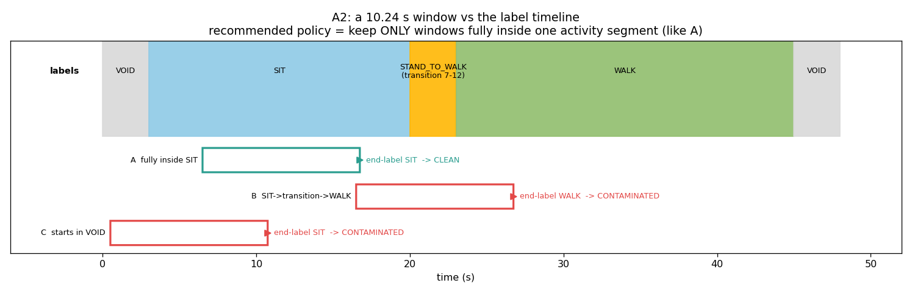
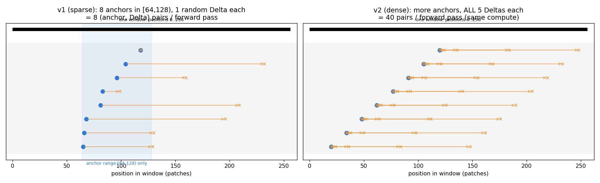

# HGLP v2 프로토콜 — 질문과 답 (읽기용 해설)

이 문서는 `PROTOCOL_ko.md`를 읽으면서 당신이 `<>` 안에 달아둔 의문점들을 하나씩 뽑아 답한 것입니다. 프로토콜 본문이 "무엇을 정했나"라면, 이 문서는 "왜 그런지, 그게 무슨 뜻인지"를 풀어 쓴 해설판입니다. 결정 자체는 여전히 프로토콜 본문과 STEP 2 검토에서 확정합니다.

한 가지 미리 짚어둡니다. **당신의 질문 하나(Q15)가 제 프로토콜 문서의 오류를 잡아냈습니다.** 위치 임베딩이 "안 학습된다"고 제가 `pos[0:64]`까지 싸잡아 썼는데, 다시 따져보니 그 부분은 학습됩니다. 아래에서 정직하게 정정하고, 프로토콜 본문에도 반영할 항목으로 남깁니다.

---

## A. 데이터

### Q1 — causal transformer 구조에 분리가 안 되는 근본적 한계가 있는 건 아닐까? (트랜스포머도 잘 모르면서 임베딩 분리하겠다고 까부는 건 아닌지)

근본적 한계는 **없습니다.** 안심하셔도 됩니다. 이유를 나눠서 말하면 이렇습니다.

분리는 트랜스포머라는 **아키텍처의 성질이 아니라, 우리가 밖에서 걸어주는 목적함수(게이트 + xcov)가 만드는 성질**입니다. 게이트가 "먼 미래는 z_slow만 써서 맞혀라"라고 강제하니까, 먼 미래를 맞히려면 느린 정보를 z_slow에 몰아넣을 수밖에 없어집니다. 인코더가 트랜스포머든 RNN이든 TCN이든 이 논리는 그대로입니다. 트랜스포머는 그냥 입력을 64차원으로 바꿔주는 함수일 뿐입니다.

게다가 이건 이미 **경험적으로 확인된** 사실입니다. v1 합성 데이터에서 fast leak가 0.79 → 0.19로 떨어지고 regime은 0.80으로 유지됐습니다. 즉 분리가 실제로 일어났습니다. 아키텍처가 분리를 막고 있다면 이 결과 자체가 안 나왔을 겁니다.

다만 정직하게 덧붙이면, "아키텍처가 분리를 금지하진 않지만, 아키텍처의 *세부 구현*이 분리를 방해할 수는 있다"입니다. 그리고 그런 방해 요소를 우리가 실제로 두 개 잡았습니다 — 출력 LayerNorm이 두 블록 스케일을 묶는 문제(B2), 위치 임베딩·앵커 범위 문제(B1). 이게 바로 이 프로토콜 문서가 하는 일입니다. 큰일 나는 상황이 아니라, 세부를 하나씩 바로잡는 정상적인 과정입니다.

한 줄 요약: 트랜스포머라서 안 되는 게 아니라, v1이 세부 설정을 아무렇게나 둬서 압력이 제대로 안 걸렸던 것이고, 그걸 고치는 중입니다.

### Q2 — HAPT의 T_ac(max)가 "윈도우 길이에 막힌다"는 게, 우리가 윈도우를 짧게 잘라서 그런 거 아냐? 데이터 자체 길이는 충분한 것 같은데.

**정확히 맞습니다.** T_ac(max)(느린 성분의 시간척도)를 우리는 ACF로 재는데, ACF를 **윈도우 안에서만** 계산합니다. HAPT 윈도우는 10.24초(128 patch)라서, 그보다 긴 상관(예: 활동이 17초 지속되는 구조)은 애초에 측정 창 밖이라 보이질 않습니다. 그래서 T_ac(max) ≈ 24 p는 "진짜 느린 성분의 척도"가 아니라 **윈도우 길이에 눌린 하한값**입니다.

원본 기록은 3~10분씩이라 데이터 길이는 차고 넘칩니다. 문제는 데이터가 아니라 우리가 짧게 자른 윈도우입니다. 그리고 이게 딜레마의 핵심입니다. 느린 성분을 제대로 담으려면 윈도우를 늘려야 하는데(그래야 17초 활동이 윈도우 안에 들어옴), 늘리면 세그먼트 길이·오염 문제(A1의 HAPT 항목)에 부딪힙니다.

### Q3 — XJTU는 run-to-failure 데이터인데 왜 "시간척도 갭이 없다"는 거야? 이 데이터에 정확히 무슨 문제가 있는지 모르겠음.

좋은 질문이고 헷갈릴 만합니다. 열쇠는 **"느린 성분이 어디에 있느냐 vs 우리가 어디를 보고 학습하느냐"의 불일치**입니다.

XJTU의 진짜 느린 성분은 **열화(degradation)**입니다. 베어링이 몇 시간에 걸쳐 서서히 망가지죠. 이건 확실히 느립니다 — 분 단위로 변합니다.

그런데 우리 방법은 **윈도우 안에서 미래를 예측**하며 배웁니다. XJTU 윈도우는 **80밀리초**짜리입니다. 80ms 안에서 열화(life)는 사실상 상수입니다 — 변하질 않아요. 80ms 동안 변하는 건 오직 빠른 진동 캐리어(수 kHz)와 결함 임펄스(수백 Hz)뿐입니다.

즉 윈도우 안에는 "빠른 것"밖에 없고, "느린 것(열화)"은 그 창 안에서 고정이라 예측 과제로 배울 수가 없습니다. 느린 축은 스냅샷과 스냅샷 사이(분 단위)에만 존재하는데, 스냅샷은 1.28초짜리가 1분에 한 번 찍혀서 서로 뚝뚝 끊겨 있으니 그 축을 이어서 볼 방법이 없습니다.

그래서 "run-to-failure라 느린 게 분명히 있는데도" 우리 방법으로는 못 잡는, 예측된 음성 사례입니다. 데이터가 느린 성분을 안 가진 게 아니라, 우리의 80ms 윈도우 안에는 그 느린 축이 통째로 빠져 있는 것입니다.

### Q4 — "τ 양쪽에 최소 2개씩"이라는 기준이 너무 작지 않아? 고작 몇십~몇백 개 예제로 50만 파라미터 모델을 학습하려는 거 아님?

두 가지를 분리해야 합니다. "τ 양쪽에 horizon 2개씩"은 **학습 예제 개수가 아니라 Δ(horizon) 축의 눈금 개수**입니다. Δ는 {1, 4, 16, 64, 128} 다섯 종류뿐이고, 이건 "몇 배 먼 미래까지 볼 것인가"의 격자일 뿐, 데이터 양과는 무관합니다.

실제 학습 예제 수는 훨씬 많습니다. 하나의 forward pass에서 (윈도우 × 앵커 × Δ) 조합이 나오고, 이게 batch 64 × 3000 스텝만큼 반복됩니다. 합성 데이터는 생성기라 사실상 무한하니 데이터가 병목이 아닙니다.

다만 당신 직관이 맞는 지점이 있습니다 — 실데이터에서는요. HAPT는 서로 다른 윈도우가 2,926개(그중 깨끗한 건 1,250개)뿐이고, 0.5M 파라미터 모델 기준으로는 분명히 적습니다. 앵커·Δ를 아무리 촘촘히 뽑아도 "서로 다른 실제 관측"의 다양성은 윈도우 수가 상한입니다. 이게 HAPT가 과적합에 취약하고 결과가 약한 이유 중 하나이며, 그래서 HAPT를 probe 전용으로 격하하자는 것(A1의 추천 b)과도 연결됩니다. 즉 "예제가 적다"는 걱정은 합성엔 해당 없음, 실데이터엔 진짜 문제입니다.

### Q6 — HAPT에서 "자기 활동 세그먼트보다 긴 윈도우"가 왜 문제지? 차근차근 짚어줬으면. (문서 전반에 걸친 궁금증)

위 그림을 같이 보면서 차근차근 가겠습니다.

1. HAPT의 "느린 성분"은 **활동(activity)**입니다. z_slow가 배워야 할 대상이 바로 이 활동 라벨이죠.
2. 그런데 라벨은 각 활동 세그먼트 안에서만 일정합니다. SIT는 20초, 그다음 WALK는 22초… 이렇게 바뀝니다.
3. 만약 윈도우가 **활동 세그먼트보다 길면**, 한 윈도우 안에 SIT 끝부분 + 전환 + WALK 앞부분이 다 들어갑니다. 그러면 그 윈도우의 "정답 활동"이 하나로 정의되질 않습니다. 앞은 SIT인데 뒤는 WALK니까요.
4. z_slow는 "이 윈도우의 느린 성분은 무엇인가"를 하나의 값으로 배워야 하는데, 윈도우 자체가 두세 개 활동을 걸치면 배울 목표가 흐려집니다. 게다가 v1은 끝점 라벨(WALK)을 붙이니, 앞부분(SIT) 신호는 라벨과 안 맞는 노이즈가 됩니다.
5. EDA 수치로는, L=256(20.5초) 윈도우가 활동 세그먼트(중앙값 17.2초)보다 길어서 **92%가 경계를 걸칩니다.** 즉 거의 모든 윈도우의 정답이 오염됩니다.

한 줄 요약: 윈도우가 "라벨이 일정한 구간"보다 길면, 그 윈도우의 정답 자체가 모호해져서 z_slow가 뭘 배워야 할지 흐려집니다. 그림의 A(세그먼트 안에 쏙 들어감)는 깨끗하고, B·C(경계를 걸침)는 오염된 경우입니다.

### Q7 — HAPT를 probe 전용으로 격하한다는 추천(b)에 대해: pretrain을 못하면 probe도 못하지 않아?

날카로운 지적입니다. 핵심은 **어떤 데이터로 pretrain하느냐**입니다. HGLP의 pretrain(게이트로 slow/fast 나누기)은 합성 데이터에서 하는 게 주력입니다. 실데이터에서 우리가 보여주려는 건 "합성에서 배운 방식이 실데이터에서도 통하는가"이고, HAPT의 역할은 그 적용 테스트입니다.

그래서 (b)의 취지는 두 가지로 나뉩니다. 첫째, HAPT 자체로 slow/fast를 pretrain해서 "HAPT에서 분리 성공했다"고 주장하는 것을 접자 (EDA상 그 주장은 오염·끝점판독 때문에 방어가 안 됨). 둘째, 대신 HAPT는 이미 학습된 인코더에 shift·label-efficiency probe만 얹어 "z_slow가 분포이동에 강한가, 라벨 적을 때 유리한가"라는 다른 종류의 증거를 뽑자.

그러니 pretrain 자체를 안 하는 게 아니라, "HAPT pretrain 결과를 분리 성공의 헤드라인으로 내세우지 않는다"는 뜻입니다. 다만 당신 말대로 이 경계가 문서에 애매했으니, 최종 결정 시 "probe에 쓰는 인코더는 무엇으로 학습하나"를 명시해야 합니다. 이건 STEP 2에서 못 박을 항목으로 올리겠습니다.

### Q8 — "윈도우가 한 활동 세그먼트 안에 완전히 들어간다"는 제약이 왜 필요함? (그리고 시각화해서 보고 싶음)

시각화는 Q6의 그림(`explain_window_policy.png`)이 그대로 답입니다 — 세그먼트 타임라인 위에 깨끗한 윈도우 A와 오염된 B·C를 겹쳐 그렸습니다.

제약이 필요한 이유는 Q6와 같은 뿌리입니다. 이 제약이 하는 일은 "윈도우의 정답을 명확하게 만드는 것"입니다. 윈도우가 한 세그먼트 안에 완전히 들어가면 그 윈도우의 모든 샘플이 같은 활동이라 정답이 하나로 딱 정해지고, z_slow가 "이 윈도우 = SIT"을 깨끗하게 배웁니다. 반대로 걸치면 정답이 모호해지고 끝점 라벨이 앞부분과 불일치해서 학습 신호에 노이즈가 낍니다.

즉 이 제약은 "느린 성분을 배우려면, 그 느린 성분이 윈도우 내내 실제로 일정한 윈도우만 써야 한다"는 당연한 요구를 코드로 강제하는 것입니다. 제약을 안 걸면 57%가 오염된 채로 학습·평가돼서, 나중에 "이게 진짜 느린 성분을 잡은 건지, 끝부분만 본 건지" 구분이 안 됩니다.

### Q9 — VOID는 버리는 게 맞음. VOID가 끝나는 시점부터 다음 시작 지점까지 샘플링해야 하는 것 아닌가?

**정확히 맞고, 그게 제 추천의 정석 구현입니다.** 방식은 이렇습니다. 라벨 시퀀스를 훑어 연속된 단일 활동 세그먼트(VOID로 시작해서 VOID/전환으로 끝나는 구간의 안쪽)를 먼저 찾고, 그 세그먼트 안에서만 윈도우를 자릅니다. 그러면 VOID도, 전환 클래스도, 다른 활동도 윈도우에 절대 안 섞입니다.

즉 "VOID가 끝난 지점 ~ 다음 경계 전"이 하나의 유효 구간이고, 그 안에서 (세그먼트가 윈도우보다 길 때만) 윈도우를 뽑는 겁니다. 이렇게 하면 A2.1(라벨 위치)과 A2.2(VOID·전환 처리)가 한 번에 해결됩니다. 당신이 말한 샘플링 방식이 바로 제가 추천에서 의도한 것입니다.

### Q10 — 80ms는 우리가 정한 거야? life fraction이 1이 될 때까지 이어지는 거야?

**80ms는 우리가 정했습니다.** `L=512 patch × 4 samples/patch ÷ 25,600 Hz = 2048/25600 = 0.08초`입니다. XJTU 원본 스냅샷은 1.28초(32,768 샘플)인데, 우리가 그 안에서 80ms짜리 조각을 잘라 씁니다(스냅샷당 6개).

life fraction은 윈도우가 아니라 "스냅샷"에 붙는 값이고, 0(첫 스냅샷)부터 1(마지막 = 고장 직전 스냅샷)까지 갑니다. 한 베어링의 전체 수명(예: 123분)을 0~1로 정규화한 것이고, 우리는 그 수명 구간에서 16개 스냅샷을 고르게 뽑습니다(life ≈ 0, 0.07, …, 1.0). 각 80ms 윈도우는 자기가 속한 스냅샷의 life 값을 라벨로 물려받고, 그 윈도우 안에서는 life가 상수입니다. 즉 윈도우가 life=1까지 쭉 이어지는 게 아니라, life=1은 그냥 "마지막 스냅샷"이고 윈도우들은 80ms짜리로 뚝뚝 떨어져 있습니다.

### Q11a — 윈도우별 z-score로 중력 방향을 지우면, 하나의 변수(축)만 봐서는 slow factor 예측이 불가한 것 아냐?

윈도우별·축별 z-score를 그대로 두면 맞습니다 — 한 축만 보면 자세를 못 맞힙니다. SIT/STAND/LAY는 크기가 다 ≈1g이고 오직 중력이 어느 축에 실리는지(방향)로만 구분되는데, 축마다 평균을 빼버리면 그 방향 정보가 사라지니까요.

하지만 이게 바로 우리가 정규화를 바꾸려는 이유입니다. 데이터셋 전역 정규화로 바꾸면 축 간 상대적 크기(= 중력 벡터의 방향)가 보존되므로, 3개 축을 함께 보면 자세가 복원됩니다. 요점은, 한 축만으로는 원래 어렵고, 정보는 축들 사이의 관계에 있으며, 그 관계를 지우지 않는 정규화(전역)를 써야 한다는 것입니다.

### Q11b — 우리 방법론은 foundation model이 아니라 dataset-wise training을 지향하니까, RevIN 같은 일반화 기법이 필요 없는 건가?

**정확합니다.** RevIN(윈도우별 정규화)은 "여러 미지의 시계열을 하나의 예측 모델로 커버하되 각 시계열의 스케일·분포가 제각각일 때, 그 차이에 휘둘리지 않게" 만드는 기법입니다 — 즉 분포이동에 대한 강건성이 목적이죠.

그런데 우리는 데이터셋마다 따로 학습하고(범용 foundation model 아님), 무엇보다 우리가 잡으려는 신호(느린 성분)가 종종 RevIN이 지워버리는 바로 그 절대 레벨·방향입니다. 그래서 RevIN식 윈도우 정규화는 우리에게 오히려 독입니다. 전역 정규화면 충분하고, 그게 신호를 보존합니다. 당신 이해가 맞습니다.

### Q12 — 데이터셋 전역 표준화는 왜 필요해? 애초에 표준화가 우리 문제에서 왜 필요해? 합성 데이터는 왜 raw로 넣었어?

세 질문으로 나눠 답합니다.

**표준화가 왜 필요한가.** 순전히 최적화 안정성 때문입니다. 입력 채널들의 크기(scale)가 제각각이면(예: 한 채널은 ±0.01, 다른 채널은 ±1000) 그래디언트가 큰 채널에 휘둘리고 학습이 불안정해집니다. 표준화는 채널들을 비슷한 크기로 맞춰 학습이 잘 되게 합니다. 정보 내용을 바꾸려는 게 아니라, 수치적으로 다루기 좋게 만드는 것입니다.

**왜 하필 전역(dataset-global)인가.** 표준화는 "어느 범위에서 평균·표준편차를 구하느냐"가 관건인데, 정보를 지우지 않는 범위여야 합니다. 윈도우별로 하면 윈도우 안 구조(중력 방향, 절대 레벨)를 지워버립니다(Q11a). 전역(학습 split 전체에서 채널당 하나의 평균·표준편차)으로 하면 크기만 맞추고 윈도우 내·윈도우 간 구조는 그대로 보존됩니다. 그래서 "표준화는 하되 전역으로"입니다.

**합성은 왜 raw인가.** 합성 데이터는 이미 적당한 고정 스케일로 생성됩니다(신호 진폭 ≈1, u의 기여 ≈0.2 — 설계된 SNR). 생성기가 하나라 기록 간 스케일 불일치가 없고, 진폭 자체가 신호의 일부라 표준화하면 설계한 SNR이 왜곡될 수 있습니다. 그래서 굳이 표준화할 이유가 없고 raw가 맞습니다. 실데이터는 센서·개인·기록마다 스케일이 달라서 표준화가 필요하지만, 합성은 그 문제가 애초에 없습니다.

### Q13 — acc + gyro를 쓴다면 정확히 어떻게 쓴다는 거야?

**입력 채널로 이어붙입니다(concatenate).** 지금 HAPT 입력은 patch당 가속도 3축이라 `(L, PATCH×3)` 모양입니다. 자이로(각속도 3축)를 더하면 `(L, PATCH×6)`이 되고, 인코더의 첫 Linear 입력 차원이 `P×3`에서 `P×6`으로 커집니다. 그게 전부입니다 — 모델 구조는 그대로고 입력 채널만 6개로 늘어납니다.

자이로는 회전(각속도) 정보를 주므로, 가속도만으로 헷갈리는 활동(예: 걷기 vs 계단오르기 — 몸통 회전 패턴이 다름)을 구분하는 데 도움이 될 수 있습니다. ablation은 "실제로 도움이 되는가"를 확인하는 것입니다.

### Q14a — AM(진폭변조) 프레이밍에서는 왜 한 채널이면 충분한데?

XJTU를 우리는 진폭변조(AM) 관점으로 봅니다. 빠른 진동 캐리어(수 kHz)가 있고, 그 포락선(진폭)이 결함에 따라 커집니다. 결함 신호는 이 포락선에 실려 있죠. 포락선을 뽑으려면(Hilbert 변환) 캐리어 신호 하나만 있으면 됩니다 — 한 채널 안에 캐리어와 그 포락선이 다 들어 있으니까요.

수평 채널 하나가 이미 "캐리어 + 결함으로 변조된 포락선"이라는 AM 구조를 온전히 담고 있습니다. 수직 채널은 같은 결함을 다른 축에서 본 대체로 중복된 시야라, 우리가 보여주려는 AM·포락선 논지에는 불필요합니다. 실제 산업 진단에선 두 축을 다 쓰기도 하지만, 우리의 음성 사례 시연에는 한 채널로 충분합니다.

### Q14b — "흔한 단일리드 선택"으로 눙치지 말고, 왜 리드 II가 standard인지, 왜 리드 II를 골랐는지 설명해.

리드 II가 표준인 이유는 심장의 전기축과 거의 나란하기 때문입니다. 리드 II는 오른팔(−)에서 왼다리(+)로 이어지는 방향을 재는데, 이 방향이 심장이 탈분극되는 평균 전기축과 거의 일치합니다. 그래서 P파·QRS파가 가장 크고 뚜렷한 양(+)의 편향으로 잡히고, 특히 P파(심방 활동)가 가장 잘 보입니다. 그 덕에 리듬 판독의 기본 리드로 임상에서 리드 II를 씁니다.

PTB-XL을 포함한 단일리드 ECG 연구들이 관례적으로 리드 II를 기본으로 삼는 것도 이 때문이고, 우리도 그 관례를 따르면서 단일 채널로 가장 깨끗한 심박 형태를 얻으려고 리드 II를 골랐습니다.

---

## B. 학습 태스크

### Q15 — 앵커로 뽑혀야만 절대 위치 임베딩이 학습되는 이유가 뭐야? 위치 임베딩이 학습 안 되면 무슨 문제가 생겨?

여기서 **제 프로토콜 문서를 정정합니다.** 당신 질문 덕에 다시 따져봤더니, 제가 "`pos[0:64]`와 `pos[128:256]`가 학습 안 된다"고 쓴 건 절반이 틀렸습니다. 정확히는 이렇습니다.

위치 임베딩 `pos[k]`는 위치 k에 더해지는 학습 가능한 벡터입니다. 여기에 그래디언트가 흐르려면, 손실이 위치 k에 의존하는 출력을 거쳐야 합니다. 그런데 causal 트랜스포머에서 위치 p의 출력은 `pos[0..p]`를 전부 봅니다(어텐션). 손실은 앵커 위치 `[64,128)`의 출력에서 나오고, 앵커 출력(위치 64~127)은 `pos[0..127]`을 봅니다. 따라서 **`pos[0:64]`는 앵커들이 어텐션으로 참조하므로 학습됩니다.** 제가 여기서 틀렸습니다.

진짜 학습 안 되는 건 **`pos[128:256]`뿐**입니다. 어떤 앵커도 128 이상이 아니고, 타깃은 EMA(그래디언트 없음)라, 위치 128~255의 임베딩엔 신호가 안 갑니다.

학습 안 되면 무슨 문제인가 하면, `pos[128:256]`은 초기값(×0.02, 아주 작음) 그대로 남습니다. 그래서 두 가지가 생깁니다. 첫째, 타깃은 `anchor+Δ ∈ [65,256)`에서 뽑는데, EMA 타깃 인코더도 이 미학습 임베딩을 물려받으므로 먼 Δ의 타깃(위치 128~255)이 과제로 다듬어진 적 없는 다소 임의적인 값이 됩니다 → 먼 horizon 학습에 노이즈. 둘째, 평가는 하필 위치 255를 읽습니다 → 과제가 한 번도 손댄 적 없는 표현을 probe.

초기값이 작아서 "완전 쓰레기"까진 아니지만, 학습이 [64,128) 문맥에서만 압력을 걸었는데 평가는 0~255 전체 문맥의 255번 위치를 읽는 불일치가 본질적 문제입니다. 요약하면 재앙급 버그는 아니고, 학습과 평가가 서로 다른 위치·문맥을 쓰는 방법론적 부정합입니다. 프로토콜의 심각도 표현도 이 톤으로 낮추겠습니다.

### Q16 — 상대 위치 인코딩은 요술지팡이가 아닐 텐데, 우리가 간과하는 trade-off가 뭔지 자세히.

맞습니다, 공짜가 아닙니다. 트레이드오프를 하나씩 짚으면 이렇습니다.

첫째, 구현 복잡도입니다. RoPE·relative bias는 어텐션 내부를 손봐야 합니다(절대 임베딩은 그냥 더하기라 단순).

둘째, 절대 위치 정보의 소실입니다. 상대 인코딩은 "내가 윈도우의 몇 번째냐"라는 절대 위치를 아예 표현 못 합니다. 만약 느린 성분이 윈도우 내 절대 위치와 상관있다면 손해입니다. 다만 우리는 윈도우를 랜덤 위치에서 자르므로 절대 위치가 애초에 의미 없어서, 이 손실이 문제가 안 됩니다(오히려 상대가 자연스러움).

셋째, 외삽(길이 일반화) 한계입니다. RoPE는 학습 때 안 본 긴 길이로 가면 성능이 떨어지고, NTK-scaling 같은 보정이 필요합니다. relative-bias 계열(ALiBi)은 국소성 쪽으로 편향되어 아주 먼 거리를 약하게 봅니다.

넷째, 연산이 약간 늘어납니다(어텐션마다 회전 연산, 무시할 수준).

여기서 중요한 대안을 하나 제시합니다. 당신이 "요술지팡이 아니다"라고 경계하는 만큼, 사실 옵션 **(b)** — "앵커 범위를 유효 전 범위로 넓히고, 평가로 읽는 위치가 반드시 학습됐는지 assert" — 가 상대 인코딩의 트레이드오프를 하나도 안 지면서 버그만 없애는 더 보수적인 선택입니다. 절대 학습 임베딩을 유지하되 모든 타깃·평가 위치가 학습되게만 보장하면 됩니다. 프로토콜엔 (a)를 추천했지만, 당신의 우려를 반영하면 (b)를 기본으로, (a)는 B3(연속 Δ)와의 시너지를 원할 때 정도로 톤을 바꾸는 게 맞겠습니다. 이건 STEP 2에서 같이 정하죠.

### Q17 — 모델 차원은 96인데, layer norm은 어디에 정확히 건다는 거야?

두 차원을 구분해야 합니다. **D_MODEL=96은 트랜스포머 내부 은닉 차원**이고, **D_Z=64는 최종 출력 임베딩 차원**입니다. 코드 흐름은 `h(96차원) → self.out = Linear(96, 64) → F.layer_norm(…, (64,))`입니다. 즉 LayerNorm은 96차원 트렁크가 아니라 96→64로 투영한 뒤의 최종 64차원 z에 걸립니다.

그리고 z_slow(앞 16) / z_fast(뒤 48) 분할이 이 64 안에서 일어나므로, 64 전체에 LayerNorm을 걸면 두 블록이 한 정규화로 묶입니다 — 그게 B2가 지적하는 결합 문제입니다.

### Q18 — B2에서 1번(블록별)이랑 3번(분할 전)이랑은 무슨 차이야?

**(i) 블록별 LayerNorm**은 최종 64차원을 z_slow(16) + z_fast(48)로 나눈 뒤, 각 블록을 따로 정규화합니다(16개끼리 정규화, 48개끼리 정규화). 두 정규화가 독립이라 z_fast가 커져도 z_slow 스케일에 영향이 없습니다. 결합을 직접 끊는 방식입니다.

**(iii) 분할 전 정규화**는 블록 의미가 생기기 전(즉 96차원 트렁크, 또는 64로 나누기 전)에 한 번 정규화하고, 최종 64차원 출력엔 LayerNorm을 안 겁니다. 두 블록은 상류의 정규화 통계를 공유하지만, 그 뒤 Linear 투영이 각 차원에 다른 스케일을 줄 수 있어서 v1식의 "분할 후 64 전체 정규화"가 만드는 직접 결합은 피합니다.

핵심 차이는, v1의 결합이 "블록 의미를 정한 다음 그 64를 통째로 정규화"해서 생긴다는 점입니다. (i)은 그 지점에서 블록마다 따로 정규화해 결합을 끊고, (iii)은 아예 정규화를 그 지점보다 위(의미가 생기기 전)로 옮겨서 결합이 생길 자리를 없앱니다. 둘 다 결합을 피하지만, (i)이 가장 명시적이고 최소 변경이라 추천입니다.

### Q19 — B3 문단이 통째로 무슨 말인지 하나도 모르겠음.

처음부터 다시, 쉬운 말로 가겠습니다.

**Δ 조건화가 뭐냐.** predictor(예측기)는 "지금 몇 스텝 뒤를 맞히는 중인지"를 알아야 합니다. 1스텝 뒤 예측과 128스텝 뒤 예측은 완전히 다른 과제니까요. 그래서 predictor에 Δ(얼마나 먼 미래인지)를 입력으로 넣어줍니다.

**v1이 하는 방식.** Δ를 번호표(embedding table 인덱스)로 넣습니다. Δ=1이면 0번 벡터, Δ=4면 1번 벡터, …, 이렇게 서로 아무 관계 없는 벡터 5개를 씁니다. 문제는 모델이 Δ=16이 Δ=4와 Δ=64 "사이"라는 걸 전혀 모른다는 것입니다. 또 학습에서 안 본 Δ(예: 30)는 번호표가 없으니 아예 예측을 못 합니다. 비유하자면, 월·화·수를 "순서도 없고 간격도 없는 그냥 다른 기호 7개"로 외운 것과 같습니다. 화요일이 월·수 사이라는 것도, 하루 간격이라는 것도 모릅니다.

**연속 조건화로 바꾸면.** Δ 대신 숫자 그 자체인 `log(Δ)`(스칼라 하나)를 넣습니다. 그러면 Δ=16은 문자 그대로 4와 64 사이의 숫자가 되고, 모델이 중간값도, 본 적 없는 값도 자연스럽게 보간·외삽할 수 있습니다.

**왜 중요하냐.** 우리 논문의 핵심 주장이 "horizon은 연속적인 공짜 축이다"입니다. 연속이라고 주장하려면 아무 Δ에나 대응할 수 있어야 하는데, 번호표 5개로는 그게 불가능합니다. 그래서 연속 조건화는 단순 성능 개선이 아니라 논문 주장의 성립 조건입니다.

### Q20 — Δ 오프셋이 5개인데 왜 (앵커, Δ) 쌍은 8개뿐이야?

Δ 5개는 메뉴일 뿐입니다. v1은 윈도우당 앵커를 8개 뽑고, 각 앵커마다 그 5개 메뉴 중 하나를 랜덤으로 골라 씁니다(`didx`가 앵커마다 무작위). 그래서 8개 앵커 × (앵커당 Δ 1개) = **(앵커,Δ) 쌍 8개**입니다. 5×8=40이 아니라, 8개 앵커가 각자 메뉴에서 하나씩만 집는 구조죠.

위 그림 왼쪽에서 파란 점(앵커) 8개, 각 점에서 주황 화살표가 딱 1개씩 나가는 게 이겁니다. 문제는, 게이트가 배우려면 같은 앵커에서 Δ를 바꿔가며 비교해야 하는데, 앵커당 화살표가 1개뿐이라 그 비교를 한 스텝 안에서 거의 못 한다는 것입니다.

### Q21 — B4의 방향은 맞는 것 같은데 정확히는 이해가 안 됨. 시각화하면 좋겠음.

위 `explain_sampling.png`가 그것입니다. 왼쪽과 오른쪽을 비교해 보세요.

**왼쪽 (v1, 성긴 샘플링):** 앵커 8개가 좁은 `[64,128)` 범위(파란 음영)에만 있고, 각 앵커에서 화살표 1개 → 총 8쌍.

**오른쪽 (v2, 조밀한 샘플링):** 앵커를 더 넓은 범위에 두고, 각 앵커에서 5개 Δ 화살표를 전부 쏩니다 → 총 40쌍. 같은 forward pass(같은 연산)에서 5배 많은 학습 신호가 나오고, 무엇보다 앵커마다 여러 Δ를 함께 봐서 "이 지점에서 가까운 미래 vs 먼 미래"의 대비가 한 스텝 안에 생깁니다. 이게 게이트가 배우는 핵심 신호입니다.

### Q22 — 구간 타깃으로 바꾼다고 HEPA랑 완전 같아지는 것도 아닌데, 굳이 다르게 하려 집착할 필요 있나? "게이트 닫아도 무해하다"는 논증이 기억 안 나서 결정을 못 하겠음.

두 부분으로 나눠 답합니다.

먼저 **"게이트 닫아도 무해하다"(harmless-to-close) 논증** 리마인드입니다. 이게 우리 방법의 논리적 심장입니다. 게이트는 먼 horizon에서 z_fast를 (부드럽게) 0으로 만들어 predictor가 못 쓰게 합니다. 이게 무해하려면, 먼 미래를 예측하는 데 z_fast(빠른 성분)가 어차피 쓸모없어야 합니다. 빠른 성분은 정의상 금방 잊혀서(τ보다 짧은 수명), 먼 미래엔 아무 정보가 없으니까요. 그래서 "먼 미래 예측에서 z_fast를 잘라도 예측 성능에 손해가 없다(무해하다). 그런데 z_fast를 자르면 먼 미래를 맞힐 유일한 길이 z_slow에 느린 정보를 적어두는 것뿐이다." → 결과적으로 느린 성분이 z_slow로 몰립니다. 이 논증의 전제가 point 타깃입니다. 타깃이 "t+Δ 한 시점"이면 그 시점엔 빠른 성분이 이미 사라졌으니 "z_fast는 무해하게 버릴 수 있다"가 깔끔하게 성립합니다.

이제 당신 지적, "구간 타깃으로 바꿔도 HEPA랑 완전히 같아지는 것도 아닌데 왜 집착하냐"는 맞는 말이고, 저도 (ii)가 "HEPA가 된다"고 한 건 과장이었습니다. 정확히는 이렇습니다. 구간 타깃 `x[t+1..t+Δ]`의 문제는 "HEPA와 같아진다"가 아니라, 논증의 전제가 깨진다는 것입니다. 구간 안에는 가까운 미래(t+1 근처)도 포함되고, 거기엔 빠른 성분이 아직 살아 있습니다. 그러면 "먼 horizon에서 z_fast는 무해하다"가 더 이상 깔끔히 성립하지 않습니다 — 구간 타깃이 빠른 성분을 일부 요구하니까요. 즉 반대 이유는 "HEPA 흉내 낼까 봐"가 아니라 "우리 핵심 논증(무해성)이 약해지니까"입니다. 이게 더 정확한 근거이고, 프로토콜의 (ii) 설명을 이 톤으로 고치겠습니다.

결정을 위한 제 정리는 이렇습니다. 논증을 지키려면 (i) point 타깃 유지가 안전합니다. 희석 문제는 타깃을 바꾸지 말고 "먼 Δ에 손실 가중치를 더 주기"로 완화하면 됩니다(먼 미래일수록 느린 성분만 남으니 그쪽 그래디언트를 키움). 당신이 논증이 기억 안 나 결정을 못 하겠다고 했으니 — 위 리마인드를 보고 "무해성 논증을 지키는 게 중요하다"에 동의하면 (i)이고, "희석이 더 급한 문제다"라고 보면 (iii) 잔차 방식이 절충입니다. (ii)는 논증을 약화시키므로 저는 비추입니다. 이건 여전히 당신 결정 항목으로 남깁니다.

---

## C. 평가

### Q23 — "윈도우 끝에서 고정 오프셋 위치를 probe"와 "위치 255를 읽는다"가 정확히 무슨 말인지 친절하지만 기술적으로 자세히.

용어부터 정리합니다. 윈도우 하나는 256개 위치(patch)로 되어 있고, 인코더는 각 위치마다 64차원 벡터를 하나씩 내놓습니다. 즉 `enc(x)`의 출력은 `(256, 64)`입니다.

**"위치 255를 읽는다"**는 `enc(x)[:, -1]`, 즉 256개 중 맨 마지막(255번) 위치의 64차원 벡터만 꺼내 probe에 쓴다는 뜻입니다. causal 인코더라 255번 위치는 윈도우 전체(0~255)를 다 본 요약이라, "이 윈도우의 최종 요약"으로는 자연스러운 선택입니다. 문제는 (Q15에서 본 것처럼) 학습은 앵커 `[64,128)`에서만 압력을 걸었는데 평가는 255를 읽어서, 학습이 그 위치·그 문맥 길이를 다뤄본 적이 없다는 불일치입니다.

**"윈도우 끝에서 고정 오프셋 위치를 probe"**는 항상 맨 끝(255)을 읽지 말고, 예컨대 "끝에서 몇 칸 안쪽" 같은 학습된 범위 안의 고정된 위치를 읽자는 뜻입니다. 상대 위치 인코딩(B1 a안)을 쓰면 절대 위치 자체가 무의미해지므로 "끝에서 k번째" 같은 상대 지정이 자연스럽고, 그 위치가 학습된 범위 안이도록 보장할 수 있습니다.

정리하면 이 결정은 "평가로 읽는 위치를, 학습이 실제로 다듬은 위치와 일치시키자"는 것이고, 어느 방식이든 코드에 "probe 위치 ∈ 학습 범위"라는 assert를 넣어 이 불일치가 다신 안 생기게 막습니다.

### Q24 — A2를 아직 이해 못 해서 C2 결정을 못 하겠음.

C2는 사실상 A2.1(라벨을 끝점에서 읽나, 위치별로 읽나)의 평가판입니다. A2를 위 Q6·Q8·Q9에서 풀어 설명했으니, 그걸 이해하셨다면 C2 결정은 자동으로 따라옵니다. A2.1에서 "위치별 라벨 + 깨끗한 단일 세그먼트"를 고르면, C2도 "probe하는 그 위치의 라벨을 쓴다"로 정해집니다. 즉 C2는 독립 결정이 아니라 A2.1에 종속입니다. A2만 정하시면 C2는 제가 그에 맞춰 자동 반영하겠습니다.

---

## 이 Q&A가 프로토콜에 남긴 수정거리

당신 질문들이 문서를 여러 군데 개선시켰습니다. STEP 2 승인 전에 제가 `PROTOCOL.md`/`PROTOCOL_ko.md`에 반영할 것들입니다.

- **B1 정정:** `pos[0:64]`는 학습됨. 미학습은 `pos[128:256]`뿐. 심각도 톤도 "재앙급 버그"에서 "학습·평가 위치 불일치"로 하향. 그리고 상대 인코딩(a)보다 앵커 범위 확대(b)를 기본 추천으로 조정.
- **B5 근거 교정:** (ii) 반대 이유를 "HEPA가 된다"에서 "무해성 논증의 전제가 깨진다"로 정확히.
- **A1(b) 명확화:** "probe에 쓰는 인코더는 무엇으로 학습하나"를 명시.
- **신규 그림 2장:** `explain_window_policy.png`(A2), `explain_sampling.png`(B4)를 프로토콜에 인라인.

이 수정들은 지금 바로 반영할 수도 있고, 당신이 남은 결정(특히 A2·B1·B5)을 주시면 그것과 함께 한 번에 갱신할 수도 있습니다. 문서가 아직 STEP 2 승인 대기 상태라, 저는 후자(결정과 수정을 함께 반영)를 추천합니다.
