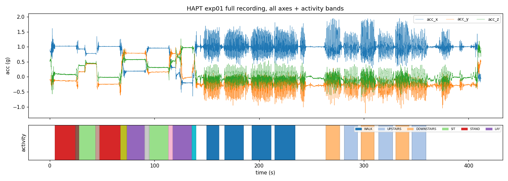
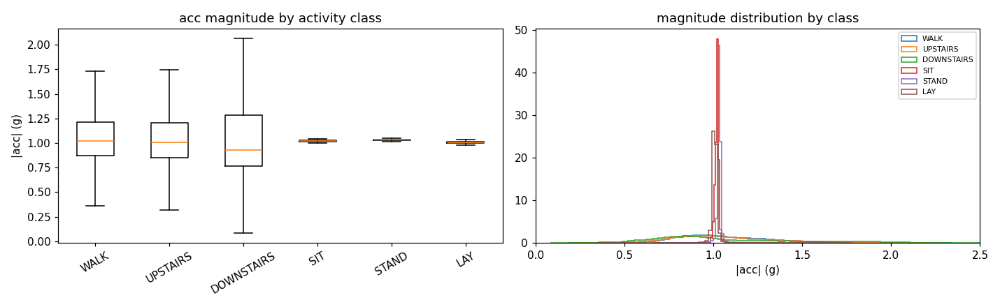
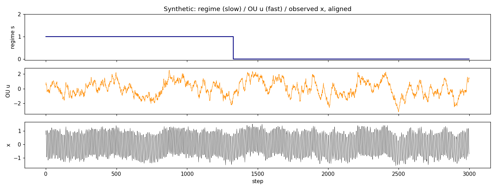
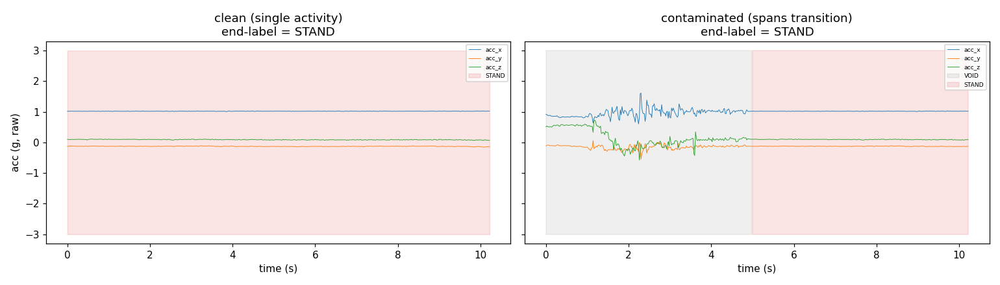
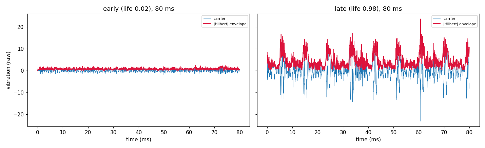
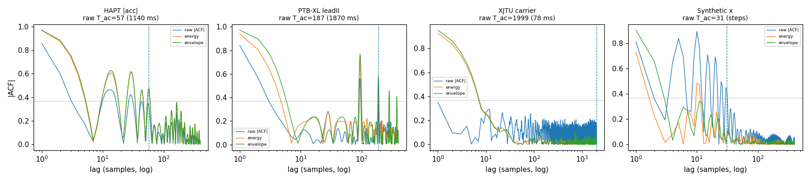

# HGLP data EDA — raw signals & labels (2026-08-03)

Observation only, from the RAW files (not prep constants). Scripts:
`eda_hapt.py`, `eda_rest.py`, `eda_prep_audit.py` (each regenerates its
numbers + figures). Prescribed skill `/mnt/skills/user/exploratory-data-
analysis/SKILL.md` is **absent on disk** — methodology followed is the
requester's STEP 0–5.

---

## STEP 0 — Locate (what exists)

| dataset | prepped | raw on disk | status |
|---|---|---|---|
| HAPT | `data/hapt.npz` (2926×128×12) | `data/hapt/RawData/` — 61 acc + 61 gyro `.txt`, `labels.txt` | ✅ raw present |
| PTB-XL | `data/ptbxl.npz` (5000×100×10) | `data/ptbxl/…-1.0.3/` (3.4 G, `records100/500` + `ptbxl_database.csv`) | ✅ raw present |
| XJTU | `data/xjtu_raw.npz` (15 bearings), `data/xjtu.npz` | `/mnt/workspace/data/MFM_data/…/XJTU-SY_Bearing_Datasets/` — **path resolves**, `.parquet` (not `.csv`) | ✅ raw present |
| Synthetic | generator only | `datagen.py` (`generate()`), no saved output | ✅ regenerable |

Nothing missing. Note the prep scripts’ hardcoded assumptions that turned out
to matter: `hapt_prep` reads only `acc_*` (gyro unused); `xjtu_raw_prep` reads
the `Horizontal` channel only (`Vertical` unused) and expects `.parquet`.

---

## STEP 1 — Raw structure

**HAPT.** 61 recordings (experiments), 30 subjects (≈2 exp/subject),
`(T,3)` accelerometer in g units, 50 Hz. Per-file duration 198 / 359 / 642 s
(min/med/max) = 9 898 / 17 963 / 32 089 samples. Values in [−2.01, 2.01] g,
no NaNs. Total 374 min of signal.

**PTB-XL.** 21 799 records, 18 869 patients; each 10 s, 12-lead, provided at
100 Hz (`records100`) and 500 Hz. Prep uses lead II @100 Hz → exactly 1000
samples/record. mV units.

**XJTU-SY.** 3 operating conditions × 5 bearings = 15 run-to-failure tests.
Each test = a sequence of 1.28 s snapshots (`32768 @ 25.6 kHz`, 2 channels)
recorded **once per minute**; snapshot count = bearing lifetime in minutes
(52–161). So one bearing = one independent recording; 15 recordings total.

**Synthetic.** Arbitrary length; per-sample ground truth (below).

The full recording already overturns the "activities are back-to-back ~12 s
dwells" picture: activity segments are separated by **large unlabeled (VOID)
gaps**, especially the walking/stairs bursts (150–360 s).

---

## STEP 2 — Label structure

### HAPT (this is where prior reasoning was wrong)

`labels.txt`: 1214 rows, schema `[exp, user, act, start, end]` (inclusive
sample indices). **12 activity classes, not 6** — 6 basic (1–6) + **6
postural-transition classes 7–12** (STAND_TO_SIT … LIE_TO_STAND), which
**do exist in this data** (we were previously unsure).

Per-class segment durations (NOT pooled), seconds:

| class | n_seg | dur min/med/max | total s |
|---|---|---|---|
| 1 WALK | 127 | 2.8 / 19.4 / 28.2 | 2442 |
| 2 UPSTAIRS | 183 | 4.4 / 12.7 / 17.9 | 2334 |
| 3 DOWNSTAIRS | 186 | 4.3 / 11.8 / 17.6 | 2159 |
| 4 SIT | 120 | 12.5 / 20.8 / 32.4 | 2534 |
| 5 STAND | 120 | 15.2 / 22.6 / 40.6 | 2762 |
| 6 LAY | 120 | 15.6 / 22.1 / 33.9 | 2737 |
| 7–12 TRANSITIONS | ~60 each | 1.5 / ~3.5 / 9.9 | ~1344 total |

- **27.0% of all raw samples are VOID (label 0)** — unlabeled. Prior
  reasoning implicitly assumed per-sample labels were fully available; a
  quarter of the signal has none.
- Basic-activity segments (1–6): n=856, median 17.2 s; 5% shorter than the
  L=128 window (10.24 s), 70% shorter than an L=256 window (20.5 s).
- Each subject contributes ~28 basic segments (tight: 28/28/33).
- Activity ORDER (exp01): `VOID→STAND→[STAND_TO_SIT]→SIT→[SIT_TO_STAND]→
  STAND→…→WALK→VOID→WALK→VOID→WALK…` — statics run contiguously via
  transition classes; **dynamics (WALK/stairs) come in short bursts separated
  by VOID.**

Static classes SIT/STAND/LAY are all ≈1.0 g (gravity) — they differ by
gravity **direction** (posture), instantaneously readable from one 3-axis
sample; dynamics have wide magnitude spread. So "activity" is largely a
short-window / instantaneous readout, which is exactly what the anchor-probe
(prior turn) measured.

### PTB-XL

Per-record diagnosis, constant across the 10 s. NORM = "normal ECG" is one
scp_code among many (top co-codes: SR, NDT, ASMI, LVH…); "non-NORM" pools all
abnormals. Full-DB balance 9514 NORM / 12285 non-NORM; prep force-balances to
2500/2500. **No within-record time annotation exists** (only `burst_noise`
flag). Granularity is per-record — the coarsest of the four.

### XJTU

Label = **life fraction = snapshot_index/(n−1)** — normalized position in the
run, **not a physical RUL**. Constant across an 80 ms window. Snapshots are
1 min apart; prep keeps 16 uniformly spaced per bearing.

### Synthetic

Ground truth **per timestep**: regime `s(t)` (3-state Markov), OU factor
`u(t)`, phase `phi(t)`. Finest granularity of the four — and the only one
with a dense, noise-free slow label.

---

## STEP 3 — Visualize

**HAPT window, clean vs contaminated:**

The "contaminated" window's contamination is **VOID** (gray), not a second
activity — the first ~5 s are unlabeled motion settling into STAND. This is
the typical case (see STEP 4).

**PTB-XL records** (`figs/ptbxl_records.png`) and **XJTU snapshots:**

Early life = low broadband noise; late life = strong periodic fault impulses
with a growing amplitude envelope. The degradation (slow factor) is minute-
scale *across* snapshots but **constant within any 80 ms window** — the
predicted-negative reason there is no exploitable within-window timescale gap.

**ACF, all datasets, log-lag, raw + derived series:**

- **PTB-XL shows periodic coherence spikes at ~90–100 lag = the heartbeat**
  (~0.8–1 s @100 Hz) — a genuine coherent-periodic component, the screen's
  Check-1 target. The last-crossing T_ac rule inflates to 187 by latching a
  beat harmonic.
- **XJTU raw T_ac = 1999 is a noise-floor artifact**; the true carrier
  decorrelates in ~7 samples. The last-crossing rule is fragile here.
- HAPT |acc| and synthetic x show oscillating (carrier-driven) ACFs with a
  decaying envelope — decay-but-slow, not coherent-periodic.

---

## STEP 4 — Prep vs raw truth

**HAPT.** From 374 min of raw signal, prep keeps **2926 windows**; it skips
1109 windows whose end-point is VOID and 261 whose end-point is a transition
class (7–12). No window crosses a file/subject boundary (loop is per-file).
Per-window end-label coverage: median 0.867, mean 0.716, **only 42.7% of kept
windows are fully clean.**

Decomposition of the **57.3% "contaminated"** figure (this corrects the
earlier interpretation):

| contamination kind | count | fraction of kept |
|---|---|---|
| clean (single label across span) | 1250 | 0.427 |
| **void-only** (label 0 elsewhere) | 733 | **0.251** |
| **transition-class** (7–12 in span) | 589 | **0.201** |
| other basic activity (1–6) | 354 | **0.121** |

So of the 57%, only **12.1% is genuine activity-to-activity**; the majority is
VOID (25%) or a labeled postural transition (20%). "Windows span an activity
transition" was the wrong description.

Normalization: HAPT is **per-window, per-axis z-score over time**
`((w−mean(0))/std(0))` — removes each axis's within-window mean and scale
(so absolute posture/gravity direction is partly normalized away; the
`accmag` fast label is taken from *raw* acc at the end-point, pre-norm).
PTB-XL: per-record z-score, lead II only, no samples dropped, ~16.8k records
unused. XJTU: per-snapshot z-score, Horizontal channel only, ~90% of
snapshots dropped.

---

## STEP 5 — What contradicts prior assumptions

| prior claim | verdict | correction |
|---|---|---|
| labels are per-sample & fully available | **partly wrong** | per-sample yes, but **27% of HAPT is VOID**; and there are **12 classes, not 6** |
| "57% of windows span a transition" | **right number, wrong meaning** | only **12%** are activity-to-activity; 25% void-only, 20% transition-class |
| end-point labelling (`per[end]`) | **confirmed** | — |
| window-vs-dwell (median dwell 17.2 s) | **incomplete** | segment median is right, but activities are **separated by VOID**, not contiguous — "window sits inside a dwell" ignores the 27% gaps |
| HAPT "static-like PTB-XL" (prior-prior) | **still its own category** | contamination is real but VOID/transition-dominated, not activity-mixing |

New facts not previously on record: **PTB-XL heartbeat is a coherent-periodic
component** (screen Check-1 relevance); **XJTU life = snapshot index, not
physical RUL**; last-crossing T_ac is **artifact-prone** on PTB-XL (beat) and
XJTU (noise); **static activities differ only by gravity direction**
(instantaneously readable — reinforces the end-region-readout finding); gyro
/ Vertical-channel / 16.8k PTB-XL records are unused; HAPT normalization
removes within-window per-axis scale.
